# Internet

## ¿Qué es?

[Internet (según Wikipedia):](https://es.wikipedia.org/wiki/Internet)
```
Internet es un conjunto descentralizado de redes de comunicación interconectadas que utilizan la familia de protocolos TCP/IP, lo cual garantiza que las redes físicas heterogéneas que la componen formen una red lógica única de alcance mundial. 

Sus orígenes se remontan a 1969, cuando se estableció la primera conexión de computadoras, conocida como ARPANET, entre tres universidades en California (Estados Unidos).
```

Si bien esta definición está muy bien, por ahí, no nos ayuda a terminar de entender bien el concepto. Para lograr nuestro objetivo vamos a dividirla en pequeñas partes y analizarlas mejor.

```
Internet es un conjunto descentralizado de redes de comunicación interconectadas.
```

Para poder comunicar 2 computadoras podemos hacerlo utilizando el concepto de red. Esto significa que de alguna forma voy a conectar estas máquinas y poder hacer cosas como copiar archivos entre sí. Existen distintas formas de conexión como pueden ser [fibra óptica](https://es.wikipedia.org/wiki/Fibra_%C3%B3ptica), [wifi](https://es.wikipedia.org/wiki/Wifi) o utilizar un [cable de red (rj45)](https://es.wikipedia.org/wiki/RJ-45).

Nuestra red puede crecer a medida que vamos conectando nuevos dispositivos, por ejemplo iniicialmente sólo tengo una máquina conectada por wifi pero con el correr del tiempo me compro un celular y una tablet que tambien puedo conectar a mi red hogareña. Vemos en este último caso como hoy en día existen más dispositivos que se pueden terminar uniendo a una red.

De esta parte de la definición podemos rescatar que parece que internet no es tanto una 'nube' como se suele decir, 

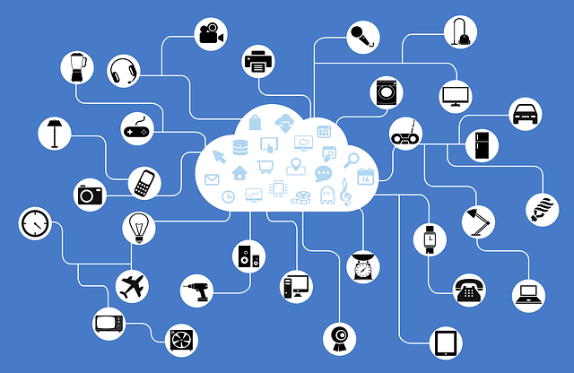

sino que tiene más que ver con un montón de computadoras que se comunican entre si.


```
que utilizan la familia de protocolos TCP/IP.
```

Ya mencionamos que las computadoras se van a comunicar entre si y la definición menciona algo de [TCP/IP](https://es.wikipedia.org/wiki/Modelo_TCP/IP). Por ahora podemos definir que este nuevo concepto es algo interno que tiene que ver con la forma en la que se comunican las computadoras. Más adelate vamos a explicar cada uno de estos conceptos dividiendolos en TCP e IP.

```
 lo cual garantiza que las redes físicas heterogéneas que la componen formen una red lógica única de alcance mundial.
 ```

 Al leer esto se me viene la siguiente imagen a la cabeza:

 

Más allá del chiste, esta parte de la definición nos cuenta una de las característica más importante que tiene Internet y es el echo de poder conectarnos/comunicarnos desde cualquier parte del mundo. Este concepto es difícil de visualizar porque significa que son millones de dispositivos conectados entre si estando a mucha distancia unos de los otros ([¿dónde estan los cables?](http://www.infobae.com/2014/10/13/1601116-el-cable-que-las-toninas-conecta-internet-toda-la-argentina/)). Internet nos abstrae completamente de eso y podemos utilizarla sin problemas.

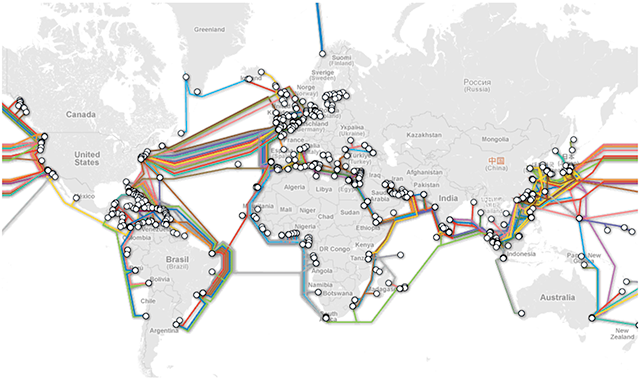

```
Sus orígenes se remontan a 1969, cuando se estableció la primera conexión de computadoras, conocida como ARPANET, entre tres universidades en California (Estados Unidos).
```

El final de la definición nos habla sobre el orígen de Internet. Si bien puede no gustarnos mucho la historia en general nos viene bien saber de donde vienen las cosas para entender porque las cosas son como son y el caso de Internet no es la excepción.

## Historia

En 1970 [Vint Cerf](https://es.wikipedia.org/wiki/Vinton_Cerf) y [Bob Kahn](https://es.wikipedia.org/wiki/Robert_Kahn) crean un proyecto militar llamado [ARPANET (Advance Research Projects Agency NETwork)](https://es.wikipedia.org/wiki/ARPANET).

La idea era crear un sistema de comunicación que pueda sobrevivir un ataque nuclear y para lograr este objetivo tenía que ser distribuido (No estar centralizado), tener conectividad desde principio a fin y también se valoraba poder escalar o crecer.

En esa época no existía un método standard para comunicarse por red, es por esto que Vint Cerf y Bob Kahn inventan un protocolo llamado Internet Working Protocol y de esta forma nace Internet, red de redes como una una filosofía de diseño.

**Vint Cerf & Bob Kahn Cracks!!**

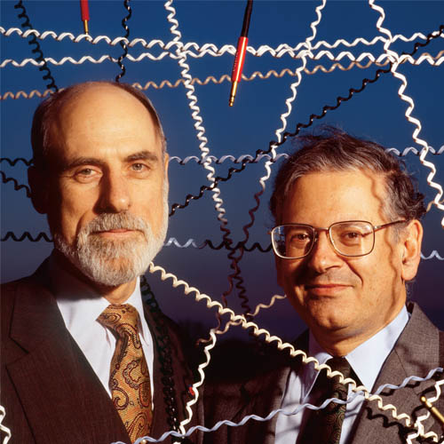

### Conceptos de Internet:

* Creada para mover información
* Es de todos
* Cualquiera se comunica con cualquiera
* Gente compartiendo conocimiento

Ahora que entendemos la definición de Internet, su utilizar y conocemos un poco su historia nos vamos a volver más técnicos (sin que sea super aburrido). 

### Unidades

Las computadoras saben leer e interpretar [binario](https://es.wikipedia.org/wiki/Sistema_binario), es decir que utilizan 0 y 1.

[Bits](https://es.wikipedia.org/wiki/Bit): El bit es la unidad mínima de información empleada en informática, en cualquier dispositivo digital, o en la teoría de la información. 

**Ejemplos del uso:**
```
1/0 prendido/apagado Si/No
```

#### Tabla de unidades

* 8 Bits hacen 1 Byte
* 1000 Bytes hacen 1 [Kilobyte (KB)](https://es.wikipedia.org/wiki/Kilobyte)
* 1000 KB hacen 1 [Megabyte (MB)](https://es.wikipedia.org/wiki/Megabyte)

Creo que es un buen momento para escuchar al gran [Chip Torres y su tema 'Te voy a dar un byte'](https://www.youtube.com/watch?v=pDVORKo8rYs)

### Formas de comunicación:

Como ya mencionamos existen distintas formas de conectar computadoras y cada una tiene sus pros y contras:

* Electricidad (depende de cables)
* Luz: Fibra optica (No se pierde señal por la distancia, es muy caro)
* Radio: Wireless/Wifi (binario pasado a frecuencia y pierde efectividad a la distancia)

### Conceptos de Redes:

Es común encontrarnos con los siguientes términos cuando hablamos de redes.

* Bandwidth / Ancho de banda: Capacidad de transmición, se mide en Bitrate.
* Bitrate: Es una unidad basada en la cantidad de bits por segundo.
* Latency / Latencia: tiempo que tarda un bit en ir desde el emisor hasta el receptor.

### Protocolo:

Las computadoras utilizan un protocolo de comounicación.

```
Set de reglas y standars bien conocidos para comunicarce entre máquinas.
```

### Internet Protocol (IP)

Existe un protocolo llamado Protocolo de Internet (IP), en la actualidad encontramos dos versiones IPv4 e IPv6. Este cambio permite que más computadoras se puedan conectar a Internet.

* La dirección en Internet es tan solo un número llamado [Internet Protocol (IP)](https://es.wikipedia.org/wiki/Internet_Protocol)
* Cada dispositivo es único y tiene una dirección única también

#### Ejemplos de dirección de IP en sus dos versiones utilizadas actualmente: 

[IPv4](https://es.wikipedia.org/wiki/IPv4)
```
  174.129.14.120
```
* Cada una de estas secciones van desde 0 a 255 representan un Byte
* Tiene una longitud de 32 bits
* Se pueden generar 4 Billones de direcciónes únicas

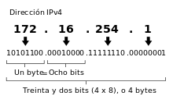

[IPv6](https://es.wikipedia.org/wiki/IPv6)
```
3FFE:F200:0234:AB00:0123:4567:8901:ABCD
```
* Tiene una longitud de 128 bits
* Se pueden generar muchas pero muchas direcciones únicas

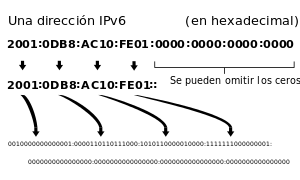

### DNS: Domain Name System

Los seres humanos somos buenos para recordar nombres pero no tanto con números. Es por esto que existe un concepto denominado [Sistema de nombres de dominio o Domain Name System (DNS)](https://es.wikipedia.org/wiki/Sistema_de_nombres_de_dominio) que permite que nosotros recordemos la dirección de google.com y las computadoras van a traducir ese nombre en la dirección/es IP que corresponda/n.

**Ejemplo:**
```
Dominio: www.google.com
IP: 174.129.14.201
```

* Forma de conectar nuestra compu al destino
* Estan divididos en grupos: .com .org .net
* Se distribuyen en forma gerárquica
* Fué creado para que sea un protocolo de comunicación Público/Abierto

**Ejemplos reales**

Podemos utilizar el comando [nslooup](https://norfipc.com/redes/como-usar-comando-nslookup-windows.html) para obtener información sobre los DNS.

```
$ nslookup google.com

Non-authoritative answer:
Name:	google.com
Address: 64.233.190.101
Name:	google.com
Address: 64.233.190.102
Name:	google.com
Address: 64.233.190.138
Name:	google.com
Address: 64.233.190.100
Name:	google.com
Address: 64.233.190.113
Name:	google.com
Address: 64.233.190.139
```

```
$ nslookup mercadolibre.com.ar

Non-authoritative answer:
Name:	mercadolibre.com.ar
Address: 209.225.49.78
Name:	mercadolibre.com.ar
Address: 216.33.197.78
```

* Tanto DNS como IP están diseñados para poder escalar.
* No existe una conección directa para que los datos lleguen de una computadora a otra.
* No necesita seguir  un camino fijo ya que puede tomar distintos caminos
* Los datos viajan en paquetes.
* En los paquetes viajan distintos tipos de datos.
* Se puede dividir en paquetes más chicos si el contenido es muy grande.
* Al llegar todos los paquetes se puede restablecer el contenido original de gran tamaño.
* Cada paquete sabe de donde viene y hacia donde va.

En Argentina podemos comprar u obtener información sobre un dominio utilizando [NIC.ar](https://nic.ar) para los dominios que son del tipo .ar (.com.ar, gob.ar, etc). También podemos utilizar servicios como [GoDaddy](https://ar.godaddy.com) para obtener dominios del tipo .com o similar.

#### DNS Spoofing: 

Al utilizar dominios tenemos que tener cuidado ya que existe un tipo de asalto denominado [DNS Spoofing](https://es.wikipedia.org/wiki/Envenenamiento_de_DNS). Los hackers pueden utilizar una técnica para retornar otro IP para un dominio y de esta forma controlar todo el tráfico que pasar por ahí.

### Routers:

En la sección anterior mencionamos que las computadoras se van a enviar datos en formato binario y pueden estar divididos en paquetes según su tamaño. Para poder redireccionar estos paquetes y que lleguen a destino necesitamos [routers](https://es.wikipedia.org/wiki/Router).

* Se encargan de direccionar los paquetes.
* Si una ruta esta congestionada busca otro camino.
* El router busca el camino más barato para llegar a destino.
* El camino puede no ser el más efectivo.
* Fault Tolerant: Se pueden mandar paquetes por distintos caminos si hay algún problema en algún lado.

### TCP: Transmission Control Protocol

El [Protocolo de Control de Transmisión o Transmission Control Protocol (TCP)](https://es.wikipedia.org/wiki/Transmission_Control_Protocol) garantiza que los datos serán entregados en su destino sin errores y en el mismo orden en que se transmitieron. 

* Maneja o administra que todos los paquetes enviados y recibidos.
* Es como un correo garantizado.
* Al recibir todos los paquetes TCP firma que esta todo bien y le envía a la otra computadora un recibo.
* En caso de faltar algún paquete TCP no lo va a confirmar y el server va a tener que enviar todos los paquetes restantes.

#### TCP + Router:

* Escalan.
* Cuantos más routers tenemos más confiable es.
* Se puede escalar/crecer sin cortar el servicio.
* Diagrama de Connect/Communicate/Collaborate.

### TCP/IP:
Podemos decir entonces que:

**TCP:**  Garantiza que los datos serán entregados en su destino sin errores y en el mismo orden en que se transmitieron.

**IP:**   Identifica, de manera lógica y jerárquica, a una Interfaz en red (elemento de comunicación/conexión) de un dispositivo.

Pdoemos tener una vista con un poco de abstracción:

```
DNS
TCP/IP & Routers
Cables / Radio / Wifi
```

Ahora que vimos todos estos conceptos podemos ver que Internet se parece más a algo como esto:

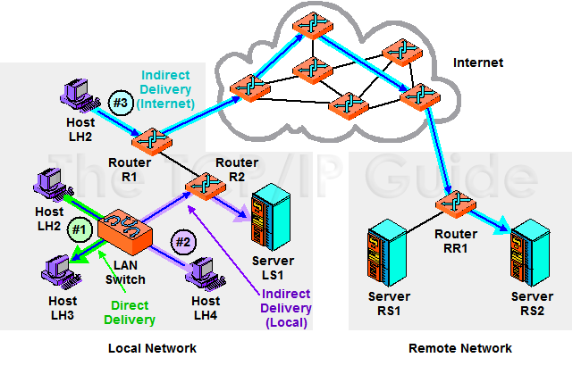

```
Gracias a todos estos conceptos podemos comunicar computadoras enviando y recibiendo datos en formato binario que viajan en pequeños paquetes. Con todos estos conceptos podemos entender qué es internet y cómo funciona a un más bajo nivel sin entrar mucho en detalle. Al ser programadores esta bueno conocer un poco sobre las cosas que vamos a estar utilizando en nuestros programas.
```

## Programación WEB:

Todos los conceptos que vimos hasta ahora nos ayudan a entender como funciona Internet en general. En esta sección nos vamos a centrar en ver cómo funciona una página o aplicación web.

### Cliente/Servidor

Cuando programamos una aplicación web estamos utilizando una arquitectura conocida como [Cliente Servidor](https://es.wikipedia.org/wiki/Cliente-servidor). Para explicar mejor este concepto vamos a utilizar un par de ejemplos de actividades que realizamos a menudo.

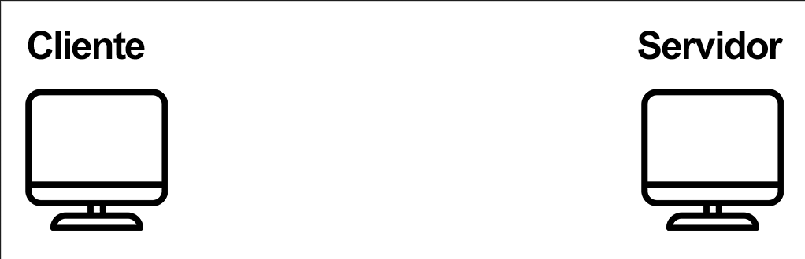

### Ciclo de vida de una página web:

1. Abrir un browser o Navegador ([Chrome](https://www.google.es/chrome/browser/desktop/index.html), [Internet Explorer](https://www.microsoft.com/es-es/download/internet-explorer.aspx), [Firefox](https://www.mozilla.org/es-AR/firefox/new), etc)

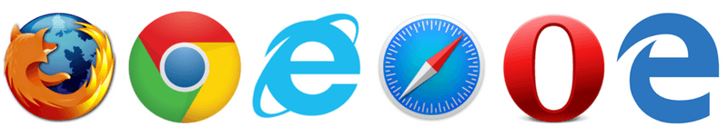

2. Introducimos una dirección (URL - Uniform Resource Locator).

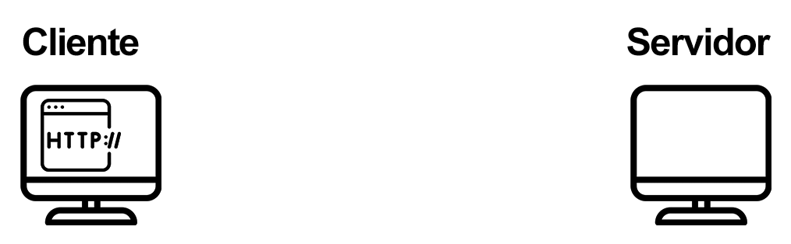

3. Mandamos un pedido al servidor para ver la página de google.

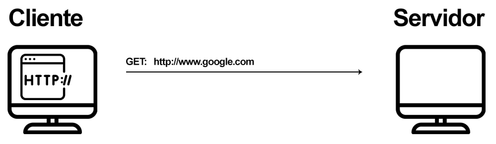

### HTTP: Hyper Text Transfer Protocol

El [Hyper Text Transfer Protocol (HTTP)](https://es.wikipedia.org/wiki/Hypertext_Transfer_Protocol) es un protocolo de transferencia. Podemos pensarlo como el lenguaje que usa una computadora para pedile un documento a otra.

Ejemplo:
```
GET Request
  GET index.html
```

* Este protocolo tiene métodos como son GET, POST, PUT y DELETE y define [mensajes de status](https://es.wikipedia.org/wiki/Anexo:C%C3%B3digos_de_estado_HTTP) como son el 200 y el 404.
* Se envían los datos en formato de texto plano
* Se pueden enviar datos utilizando el método GET en formato de [Query String](https://es.wikipedia.org/wiki/Query_string) (se ven en la URL)
* Si utilizamos el método POST los datos viajan en el cuerpo del mensaje por lo cual no se pueden ver en el navegador.
* El Server puede envíar cookies con la respuesta para saber quien sos (la cookie es un ID)
* En el próximo pedido se envía los datos de la cookie y de esa forma el server sabe quien sos.

4. El servidor recibe el pedido y se fija si tiene ese archivo. Por default busca un archivo que se llame index.html (se puede configurar)

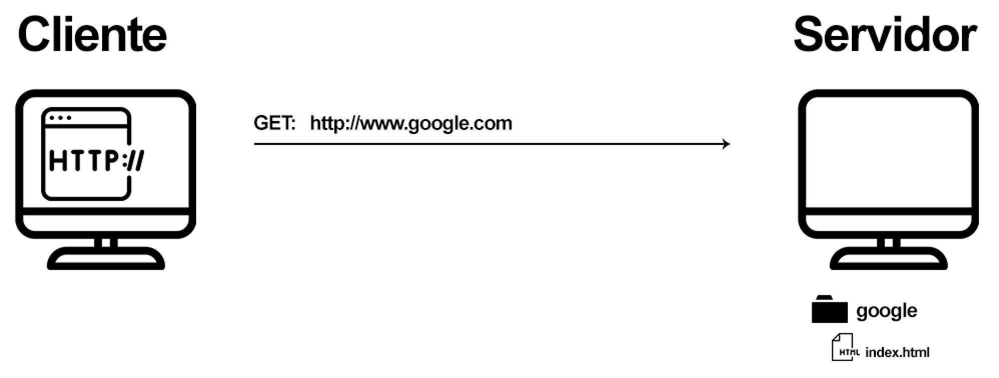

5. El servidor encuentra el archivo pedido, envía un mensaje con status 200 y el contenido del archivo indext.html en formato de texto como respuesta.

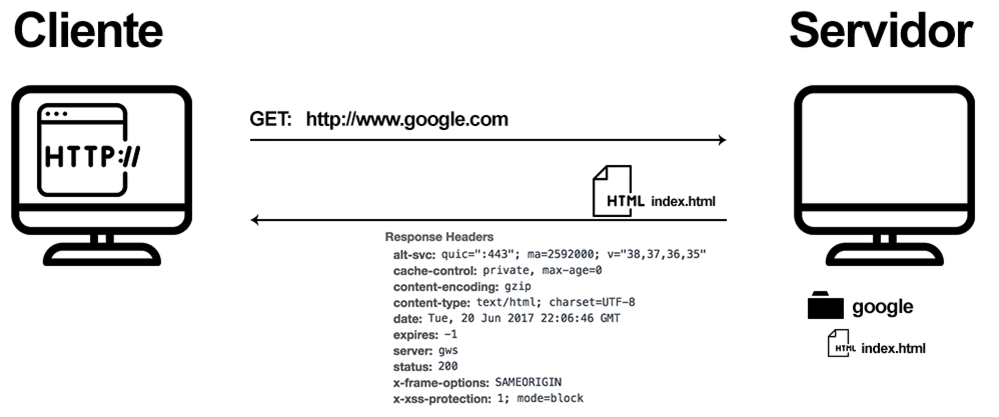

6. El browser descarga todo el contenido de la página

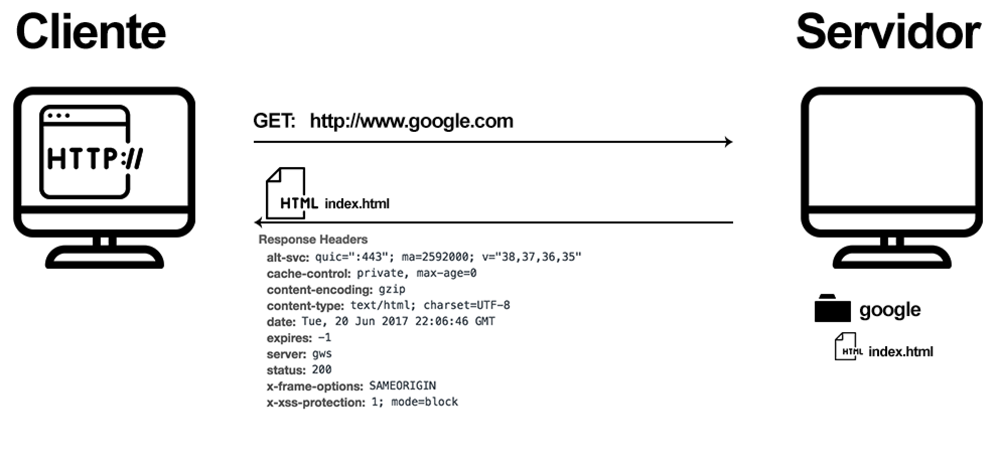

**HTML: Hyper Text Markup Language**

* [HTML](https://es.wikipedia.org/wiki/HTML) es el lenguage para decirle al Browser como tiene que mostrar/estructurar un documento utilizando tags o etiquetas.
* Tags: Son etiquetas que representan un determinado elemento, por ejemplo: un título, párrafo, link o imágen.

7. El browser lee el archivo html y hace un pedido individual por cada uno de los documentos vinculados (css, js, imagenes, etc).

* Los archivos externos como puede ser una imágen o un video van a tener un dirección única.
* El browser manda pedidos individuales por cada uno de los recursos (videos, imagenes, etc) y los va a mostrar cuando termine de recibirlos (descargar)

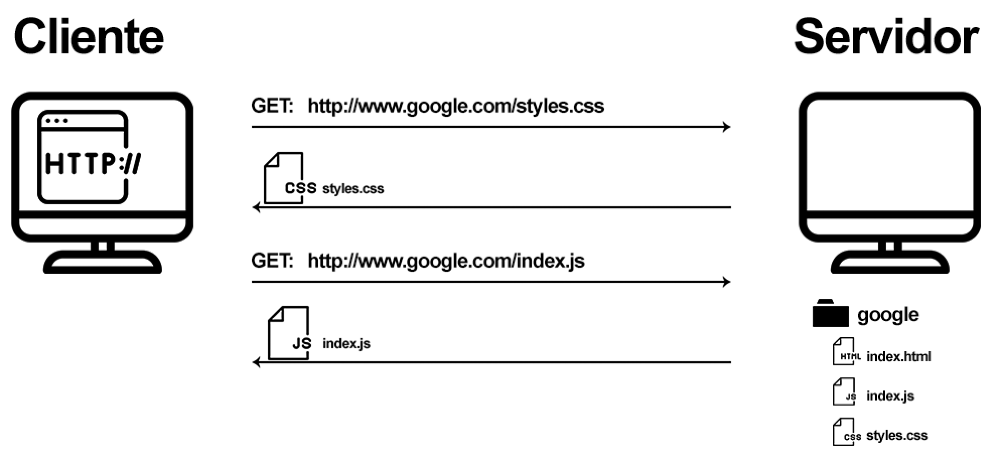

8. El browser puede renderizar todo el documento con los archivos vinculados.

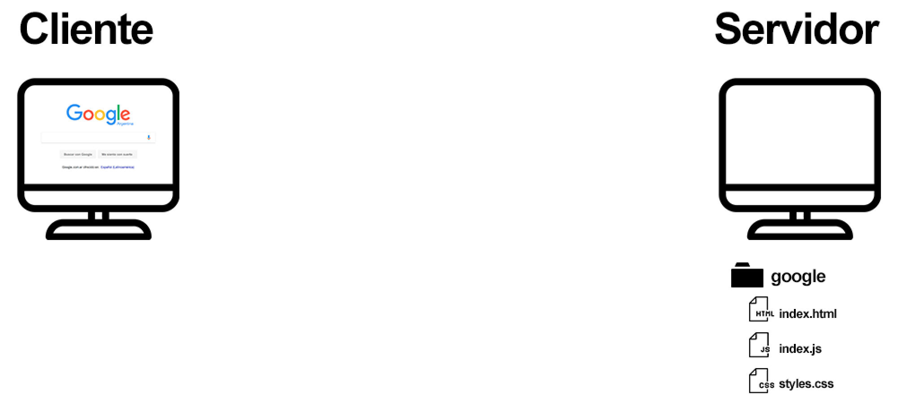

9. Si le pedimos al servidor un archivo que no puede encontrar va a retornar un mensaje con el status de 404 Document Not Found

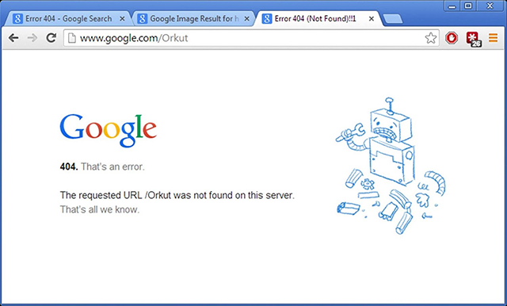

En aplicaciones donde los datos necesitan más seguridad (homebanking) podemos utilizar algún canal seguro ya que Internet es:

* Es completamente abierta.
* Las conecciones son compartidas.
* La información se envía en texto plano.
* Tiene problema de seguridad.

### HTTPS: Hyper Text Transfer Protocol Secure

Para hacer más seguras nuestras transferencias podemos utilizar [HTTPS](https://es.wikipedia.org/wiki/Hypertext_Transfer_Protocol_Secure)

* La comunicación entre el Server y Cliente se hace utilizando un Certificado Digital.
* Estos certificados los dan entidades que verifican la identidad del sitio (como un DNI).
* Si no tiene un certificado válido el browser nos muestra un error por seguridad.

A nivel de red utilizamos:

* [SSL:](https://es.wikipedia.org/wiki/Transport_Layer_Security) Secure Socket Layer
* [TLS:](https://es.wikipedia.org/wiki/Transport_Layer_Security) Transport Layer Security
* SSL & TLS: Capa que rodea y protege nuestros datos

### ¿Cómo queda nuestra Red?

Para completar nuestra red podemos decir que todas estas capas trabajan juntas:

```
HTTP & DNS
TCP/IP & Routers
Cables / Radio / Wifi
```

### Página dinámicas

En el ejemplo anterior vimos como se maneja la comunicación entre un cliente y servidor utilizando recursos (assets) estáticos. Esto quiere decir que los documentos que estan en el servidor no se modifican a no ser que alguien lo haga a mano y los vuelva a copiar. Para poder copiar archivos entre máqunas podemos utilizar un protocolo de transeferncia llamado [File Transfer Protocol (FTP)](https://es.wikipedia.org/wiki/File_Transfer_Protocol).

Para crear páginas dinámicas podemos utilizar varios lenguages como pueden ser JavaScript, Python, Ruby, C#, Java, etc. Al llegar un pedido al servidor va a identificar que el archivo pedido está en alguno de estos lenguajes y le va a delegar la responsabilidad a ellos de crear la respuesta. Es decir que vamos a tener un archivo programado en un lenguaje particular y lo que vamos a hacer es crear una respuesta en formato HTML para que el browser lo pueda interpretar.

Dado que es dinámico el usuario nos va a poder enviar un dato y en base a eso nosotros podemos generar el nuevo documento con los resultados pedidos. Por ejemplo podemos buscar en nuestra base de datos por el nombre de un producto, crear una lista de forma dinámica y escribirlo en formato HTML para mostrarlo del lado del cliente.

Al llegar a la sección de [Node.js](https://nodejs.org/es) y utilizar [Express](http://expressjs.com/) vamos a estar trabajando de esta forma.

## Videos

[Code.org®](https://code.org) es una organización sin fines de lucro dedicada a expandir el acceso a la informática y aumentar la participación de las mujeres y minorías. Crearon los siguientes videos para explicar estos conceptos y mucho más. Son muy buenos y recomiendo que los miren. Tienen subtítulos en español si activan los mismos 

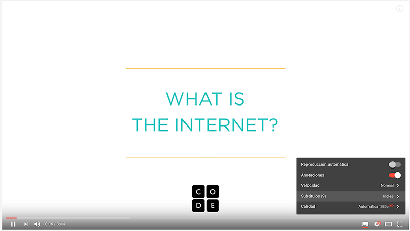

### Internet
* [¿Qué es Internet?](https://www.youtube.com/watch?v=Dxcc6ycZ73M)
* [Internet: Alambres, Cables y Wifi](https://www.youtube.com/watch?v=ZhEf7e4kopM)
* [Internet: Direcciónes IP y DNS](https://www.youtube.com/watch?v=5o8CwafCxnU)
* [Internet: Paquetes, Routing y Confiabilidad](https://www.youtube.com/watch?v=AYdF7b3nMto)
* [Internet: HTTP y HTML](https://www.youtube.com/watch?v=kBXQZMmiA4s)

### Extras
* [Internet: Encriptado y Llaves públicas](https://www.youtube.com/watch?v=ZghMPWGXexs)
* [Internet: Seguridad Informática y Crimen](https://www.youtube.com/watch?v=AuYNXgO_f3Y)
* [Internet: ¿Cómo funciona un buscador?](https://www.youtube.com/watch?v=LVV_93mBfSU)

