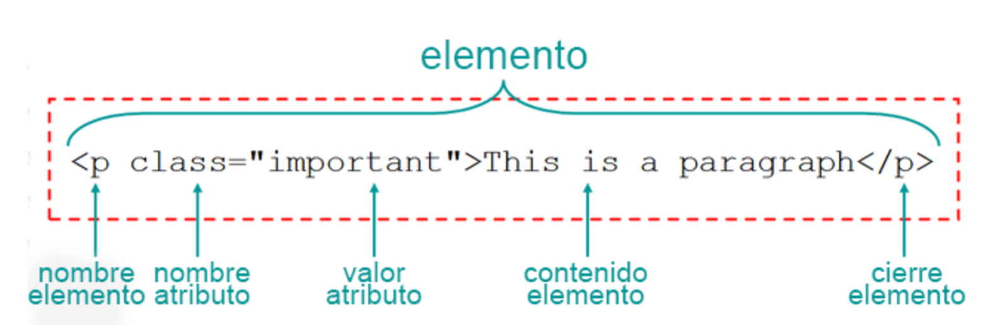

# JavaScript en el Browser 

## Ejecutar JavaScript
* En el Browser podemos ejecutar ECMAScript de la siguiente forma:
  * Por consola (como ya lo vimos)
  * Utilizando la etiqueta script
  * Incluir archivos externos

### Correr script en la etiqueta script
* HTML tiene una etiqueta llamada script que nos permite embeber código ECMAScript
* Esta etiqueta se puede poner tanto en el `head` como en el `body`
* Por ahora la vamos a utilizar en el `head`

**Ejemplo:**
```html
<head>
  <script>
    // Acá puedo escribir todo el código JavaScript que quiero
    console.log('Bienvenidos al Browser');
  </script>
</head>
```

#### Prácticas
[Ejercicio 1](../ejercicios/consignas/js-browser/ej1.md)

### Incluir un archivo externo
* Podemos incluir un archivo externo con código ECMAScript de forma similar como hacemos con CSS
* Utilizamos la etiqueta `script` y el atributo `src` con la ruta del documento que queremos vincular

**Ejemplo:**
```html
<head>
  <script src="script.js"></script>
</head>
```

```js
// archivo script.js
console.log('Bienvenido al browser')
```

* Al utilizar la etiqueta `script` para cargar un docuemento externo el browser bloquea el resto del renderizado del documento hasta que se termine de descargar y ejecutar el código solicitado
* Una vieja práctica es poner la etiqueta `script` antes del cierre del `body`
* Los browsers nuevos soportan dos atributos que nos permiten decirle al browser de que manera tiene que descargar el documento y cuando ejecutarlo
* Estas etiquetas se llaman `async` y `defer`

**Ejemplo:**
```html
<head>
  <script src="script.js" async defer></script>
</head>
```
* Para saber más sobre la carga de documentos y el browser les recomendamos leer los siguientes posts
  * [Agregar interactividad con JavaScript](https://developers.google.com/web/fundamentals/performance/critical-rendering-path/adding-interactivity-with-javascript)
  * [async vs defer (inglés)](http://www.growingwiththeweb.com/2014/02/async-vs-defer-attributes.html)
  * [async vs defer - Video (inglés)](https://www.youtube.com/watch?v=cCrfL84DkEk)

#### Prácticas
[Ejercicio 2](../ejercicios/consignas/js-browser/ej2.md)

## Interactuar con el usuario
* Los browsers tienen un objeto llamado **window** que representa la ventana del navegador
* Este objeto tiene 3 métodos que nos permiten interactuar con el usuario: alert, prompt y confirm
* Estos métodos son muy comunes por lo cual los browsers tienen ya una referencia para poder utilizarlos como funciones
* Todas estas funcionalidades bloquean el documento hasta que se resuelvan

**Ejemplo:**
```js
// Podemos llamarlos como métodos de windows:
window.alert();
window.prompt();
window.confirm();

// o como funciones
alert();
prompt();
confirm();
```

### Alert
* El método/función `alert` muestra un mensaje en pantalla al usuario
* Acepta como parámetro el mensaje que le queremos mostrar al usuario

**Ejemplo:**
```js
window.alert('Hola, estoy en el browser');
alert('Hola, estoy en el browser');
```

#### Prácticas
[Ejercicio 3](../ejercicios/consignas/js-browser/ej3.md)

### Prompt
* El método/función `prompt` nos permite pedirle un dato al usuario
* Este método acepta un mensaje que será mostrado al usuario
* Retorna un `string` con el valor ingresado por el usuario

**Ejemplo:**
```js
let dni = window.prompt('Ingrese su número de DNI');
dni = prompt('Ingrese su número de DNI');
```

#### Prácticas
[Ejercicio 4](../ejercicios/consignas/js-browser/ej4.md)
[Ejercicio 5](../ejercicios/consignas/js-browser/ej5.md)

### Confirm
* El método/función `confirm` nos permite pedirle al usuario que acepte o cancele una acción
* Este método acepta un mensaje que será mostrado al usuario
* Retorna un valor `boolean` true si el usuario confirma la acción y false si la cancela

**Ejemplo:**
```js
window.confirm('Es Ud. mayor de edad?');
confirm('Es Ud. mayor de edad?');
```

#### Prácticas
[Ejercicio 6](../ejercicios/consignas/js-browser/ej6.md)
[Ejercicio 7](../ejercicios/consignas/js-browser/ej7.md)
[Ejercicio 8](../ejercicios/consignas/js-browser/ej8.md)

## Location
* Existe un objeto llamado `location` que representa la URL del documento
* Dado que es un objeto bastante común podemos accederlo utilizado sólo su nombre

**Ejemplo:**
```js
// Como propiedad del objeto window
window.location

// Como objeto
location
```

* Por medio de sus propiedades podemos acceder a las distintas partes de la URL
  * **href**: muestra la URL como string
  * **protocol**: muestra el protocolo. ej: http, https
  * **host**: retorna un string con el nombre del host y el número de puerto en caso de que tenga uno
  * **hostname**: muestra sólo el nombre del host
  * **port**: el puerto del documento
  * **pathname**: muestra el path del recurso
  * **search**: muestra los parámetros del query string (las variables que pasamos por GET)
  * **hash**: muestra el contenido de hash (lo que tenga numeral #)

**Ejemplo:**
```js
location.href;
location.protocol;
location.host;
location.hostname;
location.port;
location.pathname;
location.search;
location.hash;
```

* Este objeto también nos permite navegar a otro documento estableciendo un valor a la propiedad `href`
* Otra opción es directamente asignar una url como string al objeto location

**Ejemplo:**
```js
location.href = 'http://google.com';
// o
location = 'http://google.com';
```

#### Prácticas
[Ejercicio 9](../ejercicios/consignas/js-browser/ej9.md)


## Timers
* Existen las funciones `setTimeout` y `setInterval` que nos permiten retrasar la ejecución de un código que nosotros elegimos

### setTimeout / clearTimeout
* Esta función se utiliza cuando queremos que nuestro código se ejecute **una sola vez** en un tiempo establecido
* Acepta como primer parámetro la función que queremos que se ejecuta
* El segundo parámetro acepta un valor numérico con la cantidad de milisegundos que queremos esperar para ejecutar la función pasada como primer parámetro

**Ejemplo:**
```js
const saludar = function() {
  console.log('hola');
}

setTimeout(saludar, 5000);
```

* En este ejemplo establecemos que queremos ejecutar la función saludar dentro de 5 segundos una sola vez
* Si queremos podemos no utilizar la variable saludar y pasar la función anónima directamente

**Ejemplo:**
```js
setTimeout(function() {
  console.log('hola');
}, 5000);
```

* Esta función retorna un valor numérico que es el ID
* Podemos cortar la ejecución de este `setTimeout` utilizando la función `clearTimeout`
* Esta función espera un valor numérico como parámetro

**Ejemplo:**
```js
var idTimeOut = setTimeout(function() {
  console.log('hola');
}, 5000);

// Cortamos la ejecución
clearTimeout(idTimeOut)
```

* En algunos casos podemos necesitar tener que pasarle parámetros a la función que se va a ejecutar
* Esta función acepta todos los parámetros que queremos de la segunda posición en adelante y los pasa como parámetros de la función que se ejecuta

**Ejemplo:**
```js
const saludar = function(nombre, apodo) {
  console.log(`hola ${nombre} ${apodo}`);
}

setTimeout(saludar, 5000, 'Marta', 'Martita');
```

* En este ejemplo vemos que podemos pasarle más de un parámetro a la función saludar desde la función `setTimeout`

#### Prácticas
[Ejercicio 10](../ejercicios/consignas/js-browser/ej10.md)
[Ejercicio 11](../ejercicios/consignas/js-browser/ej11.md)

### setInterval / clearInterval
* Existe otra función que se llama `setInterval` que nos permite ejecutar una función múltiples veces cada una cantidad establecida de tiempo
* Es similar a `setTimeout` con la diferencia que se ejecuta múltiples veces
* Retorna un valor numérico que se utiliza como ID

**Ejemplo:**
```js
const saludar = function() {
  console.log('hola');
}

const id = setInterval(saludar, 1000);
```

* En este caso se va a llamar a la función **saludar** cada 1 segundo
* Este llamado se hace hasta que cortemos la ejecución
* Podemos utilizar la función `clearInterval` para anular el llamado de `setInterval`

**Ejemplo:**
```js
const saludar = function() {
  console.log('hola');
}

const id = setInterval(saludar, 1000);

// se corta la ejecución
clearInterval(id);
```

* También podemos pasarle parámetros de la misma forma que a `setTimeout`

**Ejemplo:**
```js
const saludar = function(nombre, apodo) {
  console.log(`hola ${nombre} ${apodo}`);
}

setInterval(saludar, 1000, 'Marta', 'Martita');
```

#### Prácticas
[Ejercicio 12](../ejercicios/consignas/js-browser/ej12.md)
[Ejercicio 13](../ejercicios/consignas/js-browser/ej13.md)

## Trabajar con elementos

### Estructura de un elemento HTML
* En esta sección es importante hacer un repaso de como está compuesto un elemento HTML



* Todos los elementos tienen las siguientes partes:
  * **Etiqueta de Apertura:** es la declaración de que comienza un elemento
    * **nombre:** especifica que tipo de elemento es, puede ser un párrafo (`p`), título (`h1 a h6`), hiperínculo (`a`) entre otros.
    * **atributos** los atributos de la etiqueta nos permiten describirlos mejor o agregarle alguna funcionalidad. La estructura es siempre la misma y es **nombredeatributo="valor del atributo"**. Algunos atributos son `id`, `class`, `href`, `src`, etc
  * **contenido:** el contenido de un elemento es todo lo que encuentra entre la etiqueta de apertura y la de cierre. Puede ser texto u otros elementos
  * **Etiqueta de cierre:** el browser necesita la etiqueta de cierre para poder saber donde termina un elemento

* Por medio de ECMAScript vamos a poder crear, insertar, modificar y borrar elementos como también modificar sus atributos, valores y contenido utilizando el `DOM`

### DOM
* El document object model `DOM` proporciona una representación estructural de un documento (html o xml), permitiendo la modificación de su contenido o su presentación visual
* Esto significa que como programadores tenemos acceso a objetos que tienen propiedades, métodos y eventos disponibles para crear y manipular elementos en un documento web
* En el DOM encontramos los siguientes tipos de datos:
  * **document:** representa el documento en si mismo. Es el nodo principal.
  * **element:** representa un nodo elemento
  * **attribute:** representan los atributos de los nodos / elementos
  * **nodeList:** es un array con nodos. Sus elementos se pueden acceder por medio items o indice del array.


* Podes leer más sobre `dom` en el [sitio del MDN](https://developer.mozilla.org/es/docs/DOM)

### Carga de documento
* Para poder interactuar con los elementos necesitamos saber que el documento se descargó completamente
* El browser dispara un evento `onload` en el cual notifica que termino de descargar, leer y parsear todos los documentos e imagenes que contiene el documento
* Utilizando este evento podemos agregar nuestro código de forma segura y sin riesgo que se ejecute antes de que el documento termine de cargar

**Ejemplo:**
```js
window.onload = function() { 
	// código que se ejecuta después de que se cargó el documento
  console.log('Termino de cargar');
}
```

#### Prácticas
[Ejercicio 14](../ejercicios/consignas/js-browser/ej14.md)

* El objeto window tiene una propiedad llamada `onload` que nos permite asignar una función que se va a ejecutar después que el documento este totalmente cargado

**DE AHORA EN ADELANTE TODOS LOS EJERCICIOS QUE HAGAS EN EL BROWSER TIENEN QUE CONTEMPLAR QUE EL DOCUMENTO TERMINO DE CARGAR**

### Selectores
* Para poder interactuar con los elementos y el documento lo primero que tenemos que hacer es poder seleccionarlos
* Existen formas de acceder a los elementos de una página de manera muy simple utilizando el concepto de selectores
* Cada selector puede retornar un solo elemento o una lista según cual sea la intención del selector
* El objeto document tiene los siguientes selectores (los más conocidos) como método:
  * **getElementById:** acepta un string con el valor del atributo ID como parámetro y retorna un elemento. Retorna null en caso de no encontrar el elemento buscado
  * **querySelector:** acepta un string con un selector de css como parámetro y retorna un elemento que esté dentro del rango seleccionado utilizando el css query. Retorna null en caso de no encontrar elemento en dicho contexto
  * **querySelectorAll:** acepta un string con un valor de selector de css como parámetro y retorna una array de elementos que estén comprendidos en el contexto de búsqueda utilizando el query de css. Retorna una array vacío en caso de no encontrar elementos en dicho contexto.


**Ejemplo:**
```html
<body>
  <p>Un párrafo</p>
  <p class="rojo">Texto en rojo</p>
  <p class="rojo">Texto en rojo</p>
  <p class="rojo">Texto en rojo</p>
  <p class="rojo">Texto en rojo</p>
  <p id="principal">Parrafo principal</p>
</body>
```

```js
const elemento = document.getElementById('principal'); // obtenemos una referencia al elemento con id="principal"
const otroElemento = document.querySelector('p'); // obtenemos una referencia al elemento con el contenido 'Un párrafo'
const elementos = document.querySelectorAll('p.rojo'); // obtenemos una colección con todos los elementos párrafo de nuestro documento
```

* querySelectorAll retorna una colección de elemento es decir que podemos acceder a cada uno de los elementos de la misma forma que lo hacemos con un array. El primer elemento está en el índice 0

**Ejemplo:**
```html
<body>
  <p>Un párrafo</p>
  <p class="rojo">Texto en rojo</p>
  <p class="rojo">Texto en rojo</p>
  <p class="rojo">Texto en rojo</p>
  <p class="rojo">Texto en rojo</p>
  <p id="principal">Parrafo principal</p>
</body>
```

```js
const parrafos = document.querySelectorAll('p'); // obtenemos una colección con todos los elementos párrafo de nuestro documento
parrafos[0]; // <p>Un párrafo</p>
parrafos[1]; // <p class="rojo">Texto en rojo</p>
parrafos[5]; // <p id="principal">Parrafo principal</p>
```

* Podemos sacar como conclusión que si queremos seleccionar un elemento lo podemos hacer utilizando los selectores `getElementById` o `querySelector`. En caso de querer seleccionar varios elementos podemos utilizar `querySelectorAll`

#### Prácticas
[Ejercicio 15](../ejercicios/consignas/js-browser/ej15.md)

### Atributos
* Al seleccionar un elemento podemos acceder a sus atributos utilizando la propiedad attributes
* Esta propiedad retorna un mapa (es como un array) que tiene valores key/value con los nombres y valores de los atributos de ese elemento

**Ejemplo:**
```html
<p id="principal" class="rojo">texto principal en rojo</p>
```

```js
let elemento = document.querySelector('p')
console.log(elemento.attributes); // retorna un objeto del tipo NamedNodeMap con toda la descripción de los atributos
```

* Podemos acceder de forma indiviudal a los atributos de un elemento utilizando el método `getAttribute`
* Este método acepta un string como parámetro con el nombre del atributo que quiero obtener
* Retorna el valor del atributo y null en caso de no encontrarlo

**Ejemplo:**
```html
<p id="principal" class="rojo">texto principal en rojo</p>
```

```js
let elemento = document.querySelector('p')
let id = elemento.getAttribute('id'); // retorna principal
let clase = elemento.getAttribute('class'); // retorna rojo
console.log(id); 
```

* Otra forma de acceder a las propiedades es utilizar los atributos de HTML como propiedades de obejeto

**Ejemplo:**
```html
<p id="principal" class="rojo">texto principal en rojo</p>
```
```js
let elemento = document.querySelector('p')
let id = elemento.id;
console.log(id); 
```

* Hay un caso especial y es el uso del atributo class dado que es una palabra reservada en ECMAScript
* Para acceder o establecer el atributo class tenemos que utilizar `className`

**Ejemplo:**
```html
<p id="principal" class="rojo">texto principal en rojo</p>
```
```js
let elemento = document.querySelector('p')

let clase = elemento.className;
console.log(clase); // rojo

clase = elemento.getAttribute('class');
console.log(clase); // rojo
```

#### Prácticas
[Ejercicio 16](../ejercicios/consignas/js-browser/ej16.md)

* Los elementos tienen una propiedad classList que nos permite obtener una colección de las clases que tienen un elemento

**Ejemplo:**
```html
<p id="principal" class="rojo negrita">texto principal en rojo</p>
```
```js
let elemento = document.querySelector('p');
console.log(elemento.classList[0]); // rojo
console.log(elemento.classList[1]); // negrita
```

* La classList tiene métodos y propiedades que nos permiten interactuar con las clases de un elemento de la siguiente manera:
  * **add:** acepta como parámetro el nombre de la clase que queremos agregar en formato de string. Si la clase existe es ignorada
  * **remove:** acepta una clase como parámetro en formato string y la quita del elemento 
  * **item:** acepta un número como parámetro que representa la posición de la lista. Retorna el nombre de la clase que está en esa posición
  * **toggle:** acepta un nombre de clase como string. Agrega o quita la clase según exista o no en el elemento. Nos permite por ejemplo mostrar y ocultar elementos
  * **contains:** acepta un nombre de clase como string y retorna un valor boolean según si el elemento tiene o no esa clase
  * **replace:** acepta como primer parámetro el nombre de la clase que queremo remplazar, como segundo valor acepta el nombre de la clase que va a remplazar la anterior

**Ejemplo:**
```html
<p id="principal" class="rojo negrita">texto principal en rojo</p>
```
```js
let elemento = document.querySelector('p');
elemento.classList.add('ocultar'); // agregamos la clase ocultar
elemento.classList.toggle('ocultar'); // como tenía la clase ocultar con toggle lo sacamos
elemento.classList.remove('negrita'); // sacamos la clase negrita
elemento.item(0); // Retorna rojo que es la primer clase que tiene este elemento
elemento.contains('rojo'); // Retorna true ya que el elemento tiene la clase rojo
elemento.replace('rojo', 'verde'); // cambiamos la clase rojo por verde
```

* classList es súper util para interactuar con clases

#### Prácticas
[Ejercicio 17](../ejercicios/consignas/js-browser/ej17.md)

* Podemos saber si un elemento tiene o no un atributo en particular utilizando el método `hasAttribute`
* Acepta un string como parámetro con el nombre del atributo que quiero saber si existe en ese elemento
* Retorna un valor booleano

**Ejemplo:**
```html
<p id="principal" class="rojo">texto principal en rojo</p>
```

```js
let elemento = document.querySelector('p');
console.log(elemento.hasAttribute('class')); // true
```

#### Prácticas
[Ejercicio 18](../ejercicios/consignas/js-browser/ej18.md)

* También existe el método `hasAttributes` que nos permite saber si un elemento tiene o no atributos
* Este método retorna un valor boolean, true en caso de que el elemento tenga atributos y false en caso de que no los tenga.
* Destacamos que la diferencia entre `hasAttribute` y `hasAttributes` es que el primero nos dice si tiene o no un atributo en especial y el segundo si tiene atributos en general

**Ejemplo:**
```html
<p id="principal" class="rojo">texto principal en rojo</p>
<h2>Elemento sin atributos</h2>
```

```js
let elemento = document.querySelector('p');
let titulo = document.querySelector('h2');
console.log(element.hasAttributes():); // true
console.log(titulo.hasAttributes():); // false
```

* Para establecer atributos utilizamos el método setAttribute
* Este método acepta como primer parámetro un string con el nombre del atributo que queremos agregar
* Como segundo parámetro acepta un string con el valor que queremos para el atributo

**Ejemplo:**
```html
<h2>Elemento sin atributos</h2>
```

```js
let titulo = document.querySelector('h2');
console.log(titulo.hasAttributes():); // false

titulo.setAttribute('id', 'principal');
console.log(titulo.hasAttributes():); // true
```

* En este ejemplo vemos que al seleccionar el elemento `h2` no tiene atributos y luego utilizando `setAttribute` le podemos asignar un atributo `id` con un valor de `principal`
* En caso de querer quitar un atributo lo podemos hacer utilizando el método `removeAttribute`
* Este método acepta un string como parámetro con el nombre del atributo que queremos remover

**Ejemplo:**
```html
<h2 id="principal">Elemento sin atributos</h2>
```

```js
let titulo = document.querySelector('h2');
console.log(titulo.hasAttributes():); // true

titulo.removeAttribute('id');
console.log(titulo.hasAttributes():); // true
```

#### Prácticas
[Ejercicio 19](../ejercicios/consignas/js-browser/ej19.md)

### Relación entre elementos
* Un elemento que contiene otros elementos se considera como un elemento padre de los elementos que contiene
* Un elemento que esta dentro de otro elemento se considera hijo del elemento que lo contiene
* Por medio de el atributo `parentElement` podemos acceder **al elemento padre** del elemento seleccionado
* Con el atributo `children` podemos acceder a **la colección de elementos hijos** de un elemento

**Ejemplo:**
```html
<div>
  <p>Elemento hijo</p>
  <p>Elemento hijo</p>
  <p>Elemento hijo</p>
</div>
```

```js
let div = document.querySelector('div');
let parrafos = div.children; // obtengo la colección de elementos hijo
parrafos[0].parentElement; 
/*
  Dado que children retorna una colección puedo acceder al primer elemento utilizando un índice como en los arrays
  Utilizamos parentElement para obtener una referencia al elemento div que contiene todos los párrafos
*/
```

#### Prácticas
[Ejercicio 20](../ejercicios/consignas/js-browser/ej20.md)

* Otra relación entre elementos es la de `sibling` es decir los que estan continuos o al mismo nivel que el elemento seleccionado
**Ejemplo:**
```html
  <p>Elemento hijo</p>
  <p>Elemento hijo</p>
  <p>Elemento hijo</p>
```

* En este ejemplo vemos que los 3 elementos párrafo están al mismo nivel, es decir que son sibling
* Podemos acceder al elemento que está antes que el elemento seleccionado utilizando la propiedad `previousElementSibling`
* También podemos acceder al elemento que sigue gracias a la propiedad `nextElementSibling`

**Ejemplo:**
```html
  <p>Elemento hijo</p>
  <p>Elemento hijo</p>
  <p>Elemento hijo</p>
```
```js
const parrafos = document.querySelectorAll('p');
parrafos[1].previousSibling; // De esta forma accedemos al primer párrafo parrafos[0]
parrafos[1].nextElementSibling; // De esta forma accedemos al elemento que sigue parrafos[2]
```

#### Prácticas
[Ejercicio 21](../ejercicios/consignas/js-browser/ej21.md)

### Modificar el contenido de un elemento
* Los elementos tienen un atributo llamado `innerText` que nos permite leer o escribir contenido en modo de texto 
* Este atributo no es standar ya que lo agregó Microsoft hace muchos años en Internet Explorer y quedó dentro del DOM

**Ejemplo:**
```html
  <p>Mi Texto</p>
```
```js
const parrafo = document.querySelector('p');
parrafo.innerText; // Mi Texto

parrafo.innerText = 'ECMAScript en el browser está muy bueno';
parrafo.innerText; // ECMAScript en el browser está muy bueno
```
* La propiedad standar de los elementos para leer o modificar el contenido de un elemento se llama `textContent`

**Ejemplo:**
```html
  <p>Mi Texto</p>
```
```js
const parrafo = document.querySelector('p');
parrafo.textContent; // Mi Texto

parrafo.textContent = 'ECMAScript en el browser está muy bueno';
parrafo.textContent; // ECMAScript en el browser está muy bueno
```

* Tanto con `innerText` como con `textContent` podemos asignar o leer el contenido de un elemento en formato de string
* Existe otra forma de establecer o cambiar el contenido de un elemento y se llama `innerHTML`
* `innerHTML` paresea el texto que se va a asignar al elemento y si encuentra que ese texto tiene formato de HTML intenta crear elementos con ese contenido

#### Prácticas
[Ejercicio 22](../ejercicios/consignas/js-browser/ej22.md)

**Ejemplo:**
```html
  <p>Mi Texto</p>
```
```js
const parrafo = document.querySelector('p');
parrafo.innerHTML; // Mi Texto

parrafo.innerHTML = '<span>ECMAScript en el browser está muy bueno</span>';
parrafo.innerHTML; // <span>ECMAScript en el browser está muy bueno</span>
```

* Si bien en el ejemplo puede parecer que sólo modificamos el texto en el browser este código crea un nuevo span con el contenido ECMAScript en el browser está muy bueno y lo asigna dentro del elemento párrafo

#### Prácticas
[Ejercicio 23](../ejercicios/consignas/js-browser/ej23.md)

### Manejo de propiedades de CSS
* Los elementos HTML tienen una propiedad llamada `style` que retorna un `objeto literal` que representa los estilos que tiene un objeto
* Al ser un objeto de ECMAScript podemos agregar o modificar sus atributos
* Los nombres de las propiedades de CSS en ECMAScript se escriben con el siguiente formato: `nombreDePropiedadDeCss`
* Por ejemplo la propiedad de CSS `background-color` se escribe en ECMA como `backgroundColor`

**Ejemplo:**
```html
  <p>Elemento sin estilo pero se lo vamos a agregar de forma dinámica</p>
```
```js
let elemento = document.querySelector('p');
elemento.style; // {}
elemento.style.color = ‘red’; // seteo el color a rojo
elemento.style.fontWeight = ‘bold’; //seteo el weight a bold
```

* De esta forma podemos manipular las propiedades de `style` en nuestros elementos

#### Prácticas
[Ejercicio 24](../ejercicios/consignas/js-browser/ej24.md)

### CRUD elementos
* CRUD significa:
  * Create
  * Read
  * Update
  * Delete
* Esto significa que podemos crear, actualizar y borrar un elemento
* La parte de read podemos decir que es obtener el elemento y leer sus propiedades

#### Crear un elemento
* El objeto `document` tienen un método llamado `createElement` que nos permite crear nuevos nodos elementos HTML
* `createElement` acepta como parámetro un string con el nombre de una etiqueta de HTML (a, div, span, li, ul, etc)

**Ejemplo:**
```js
var nuevoElemento = document.createElement('p');
```
* En este ejemplo podemos ver que creamos un elemento párrafo y lo guardamos en la variable nuevoElemento
* Este nuevo elemento está en memoria y tiene la estructura de un elemento párrafo pero por el momento no tiene contenido
* Al tener una referencia de un elemento podemos interactuar con él como por ejemplo establecer un contenido, insertarlo en otro elemento, cambiarle sus atributos de `style`, etc

#### Insertar un elemento
* Los objetos tienen un método llamado `appendChild` que nos permite insertar un nodo dentro del otro
* Este método inserta el nuevo nodo como último nodo hijo del nodo contenedor

**Ejemplo:**
```js
var parrafo = document.createElement('p');
parrafo.textContent = 'Hola soy un párrafo';
var div = document.createElement('div');
div.appendChild(p);
```

* En este ejemplo vemos que creamos 2 elementos párrafo y div
* Al tener la referencia de los dos elementos podemos interactuar con ellos y en este caso estamos insertando el párrafo dentro del div

#### Prácticas
[Ejercicio 25](../ejercicios/consignas/js-browser/ej25.md)
[Ejercicio 26](../ejercicios/consignas/js-browser/ej26.md)
[Ejercicio 27](../ejercicios/consignas/js-browser/ej27.md)
[Ejercicio 28](../ejercicios/consignas/js-browser/ej28.md)

#### Remover un elemento
* Los elementos tienen un método llamado `removeChild` que nos permite remover nodos hijos
* Para poder remover un nodo tenemos que primero seleccionarlo

**Ejemplo:**
```html
<div>
  <p>Elemento sin estilo pero se lo vamos a agregar de forma dinámica</p>
</div>
```
```js
var div = document.querySelector('div');
var parrafo = div.children.item(0); // selecciono el párrafo
div.removeChild(parrafo);
```

* En este ejemplo vemos como podemos seleccionar los elementos que son hijos de otro elemento y borrarlo
* Si queremos borrar todo el contenido de un elemento podemos utilizar `innerHTML` 

**Ejemplo:**
```html
<div>
  <p>Elemento sin estilo pero se lo vamos a agregar de forma dinámica</p>
</div>
```
```js
var div = document.querySelector('div');
div.innerHTML = ''; // chau chau contenido
```

#### Prácticas
[Ejercicio 29](../ejercicios/consignas/js-browser/ej29.md)
[Ejercicio 30](../ejercicios/consignas/js-browser/ej30.md)
[Ejercicio 31](../ejercicios/consignas/js-browser/ej31.md)

#### Eventos
* Manejo de eventos del DOM
* Prevenir eventos por defecto
* Interacción con el mouse
* Interacción teclado

* El browser dispara eventos cuando pasa algo con el documento o el browser
* Por ejemplo podemos saber cuando se terminó de cargar un documento, se presiona una tecla o se mueve el mouse
* Un evento consta de las siguientes partes:
  * **Tipo de Evento:** es el nombre del evento que ocurre
  * **Target del evento:** es el objeto al cual le ocurre el evento o que está asociado a dicho evento
  * **Manejador de evento:** es una función (callback) que maneja o responde a un evento (Se lo conoce también como listener)
  * **Objeto del evento:** es un objecto asoaciado con un evento en particular que contiene detalles sobre el evento. Este objeto es pasado como parámetro de la función que maneja el evento. Las propiedades de este objeto cambian según el tipo de evento que sea. Ejemplo: puedo saber que tecla se presiona o posición del mouse dependiendo del tipo de evento que maneje.
* Existen 2 formas básicas de registrar un manejador de eventos
* Establecer una propiedad en el objeto o document
**Ejemplo:**
```js
let button = document.querySelector('button');
button.onClick = function() {
  // código para manejar que se hace al hacer click en el botón
}
```

#### Prácticas
[Ejercicio 32](../ejercicios/consignas/js-browser/ej32.md)

* La otra opción es registr un evento con `addEventListener`
* Este método puede ser aplicado en cualquier objeto, eso incluye window, document y en todos los elementos. 
* Este método soporta 2 parámetros:
  * **Tipo de evento:** es un string con el nombre del tipo de evento
  * **Manejador de evento:** es una función que se invoca cuando suceda evento
**Ejemplo:**
```js
let button = document.querySelector('button');
button.addEventListener('click', function() {
  // código que maneja el click del botón
});
```
* Dentro de la función que maneja el evento podemos utilizar la palabra reservada `this` que en ese contexto hace referencia al objeto que ejecutó el evento
**Ejemplo:**
```js
function clickHandler() {
	console.log(this)		// this en este caso apunta al elemento que ejecutó el evento
}

let button = document.querySelector('button');
button.addEventListener('click', clickHandler);
```

#### Prácticas
[Ejercicio 33](../ejercicios/consignas/js-browser/ej33.md)

* Para quitar un listener podemos utilizar `removeEventListener`
* Este método puede ser aplicado en cualquier objeto, eso incluye window, document y en todos los elementos
* Este método soporta 2 parámetros:
  * **Tipo de evento:** es un string con el nombre del tipo de evento
  * **Manejador de evento:** es una función que se invoca cuando suceda evento

**Ejemplo:**
```js
function clickHandler() {
	console.log(this)		// this en este caso apunta al elemento que ejecutó el evento
}

let button = document.querySelector('button');
button.addEventListener('click', clickHandler);
button.removeEventListener('click', clickHandler); // este botón no tienen más el menejador de evento
```

#### Prácticas
[Ejercicio 34](../ejercicios/consignas/js-browser/ej34.md)

* Por medio del objeto event podemos conocer más datos sobre el evento o prevenir que se ejecute el comportamiento por defecto de ejecución
* Para prevenir la ejecución de un evento por defecto utilizamos el método `preventDefault`

**Ejemplo:**
```js
let hipervinculo = document.querySelector('a');
hipervinculo.addEventListener('click', function(evento) {
  evento.preventDefault();  // de esta forma prevenimos que el hipervinculo ejecute su función por defecto
});
```

#### Prácticas
[Ejercicio 35](../ejercicios/consignas/js-browser/ej35.md)

* Podemos capturar algunos eventos del mouse, entre los más conocidos se encuentran: `click, dblclick, mouseover, mouseout y mousemove`
* El objeto evento asociado al mouse tiene atributos que nos permite saber la posición donde se encuentra con clientX y clientY

**Ejemplo:**
```js
let body = document.querySelector('body');
body.addEventListener('click', function(evento) {
  evento.clientX;
  evento.clientY;
});
```

#### Prácticas
[Ejercicio 36](../ejercicios/consignas/js-browser/ej36.md)

* También podemos controlar los eventos que se disparan cuando se presionan las teclas por medio de los eventos `keypress, keydown y keyup`
* El objeto del evento tiene propiedades como `charCode` que nos retorna el número de tecla que fué presionado
* Con el método `String.fromCharCode` podemos saber que letra es

**Ejemplo:**
```js
let body = document.querySelector('body');
body.addEventListener('keypress', function(evento) {
  evento.charCode;
  String.fromCharCode(evento.charCode);
});
```

#### Prácticas
[Ejercicio 37](../ejercicios/consignas/js-browser/ej37.md)
[Ejercicio 38](../ejercicios/consignas/js-browser/ej38.md)

#### Lista de eventos que se pueden utilizar:
* Existen muchos eventos que podemos utilizar para crear UI interactivas:
  * onchange
  * onclick / ondblclick / onmousedown / onmousedown
  * onmouseover / onmouseout
  * onkeydown / onkeypress / onkeyup
  * onload
  * onresize
  * onscroll
  * oninput
  * onfocus / onblur

#### Prácticas
[Ejercicio 39](../ejercicios/consignas/js-browser/ej39.md)
[Ejercicio 40](../ejercicios/consignas/js-browser/ej40.md)


## Práctica extra
[Ejercicio 41](../ejercicios/consignas/js-browser/ej41.md)
[Ejercicio 42](../ejercicios/consignas/js-browser/ej42.md)

#### Formularios
* Los formularios en HTML son una manera muy buena de obtener datos por parte del usuario.
* Por medio de ECMAScript podemos manejar los valores y eventos del formulario como también los de sus elementos
* También podemos validar los datos que el usuario ingresa
* Para poder interactuar con un formulario lo primero que tenemos que hacer es seleccionarlo

**Ejemplo:**
```js
const form = document.querySelector('form');
```

* Otra forma de seleccionar los formularios es por medio del objeto `document` y la propiedad `forms`
* La propiedad forms retorna una colección de todos los formularios que tiene el documento

**Ejemplo:**
```js
  const formulario = document.forms[0];
  const formularios = document.forms;
```

* Los elementos del tipo formulario tienen un atributo llamado `elements` y tiene la colección de elementos que tiene el formulario seleccionado

**Ejemplo:**
```js
const form = document.querySelector('form');
const elementos = form.elements;
// retorna el elemento del formulario que está en el índice indicado
const elemento = form.elements[indice];
```

* El objeto formulario tiene atributos como `action`, `target`, `encoding` y `method`
* Al ser un objeto de Javascript podemos acceder a todos ellos de la misma forma que lo hacemos con cualquier otro objeto
  * **action:** Establece la URL del documento que va a procesar la información enviada por el formulario
  * **encoding:** Establece el tipo MIME con el que se va a encriptar los datos
  * **method:** Establece cual es el método de HTTP que se va a utilizar para enviar los datos. Puede ser get o post
  * **name:** Establece el nombre del formulario

**Ejemplo:**
```html
<form action="guardar_usuario.html" method="get" enctype="application/x-www-form-urlencoded" name="login"></form>
```
```js
const form = document.querySelector('form');

console.log(form.action); // guardar_usuario.html
console.log(form.encoding); // get
console.log(form.method); // application/x-www-form-urlencoded
console.log(form.name); // login
```

#### Prácticas
[Ejercicio 43](../ejercicios/consignas/js-browser/ej43.md)

* Los elementos del formulario tienen un atributo llamado `value` que nos permite establecer u obtener el valor de un elemento
* Con la propiedad value podemos obtener el valor de varios de los elementos de un formulario como por ejemplo: 
  * inputs de texto, password, hidden
  * checkbox
  * radio
  * textarea

**Ejemplo:**
```html
<form action="guardar_usuario.html" method="get" enctype="application/x-www-form-urlencoded" name="login">
  <input type="text" id="username" name="username" />
  <input type="password" id="pass" name="pass" />
  <input type="submit" name="submit" value="Enviar" />
</form>
```
```js
const form = document.querySelector('form');
const username = form.elements[0].value;

username.value; // Obtenemos un string vacío
username.value = 'pepe'; // Establecemos el valor del input username en pepe
```

#### Prácticas
[Ejercicio 44](../ejercicios/consignas/js-browser/ej44.md)

* Por medio del evento `submit` del formulario podemos mandar los datos a otro documento
* Podemos cortar la ejecución del `submit` de un formulario retornando un valor `false`

**Ejemplo:**
```html
<form action="guardar_usuario.html" method="get" enctype="application/x-www-form-urlencoded" name="login">
  <input type="text" id="username" name="username" />
  <input type="password" id="pass" name="pass" />
  <input type="submit" name="submit" value="Enviar" />
</form>
```
```js
const form = document.querySelector('form');

form.onsubmit = function() {
	// Este evento maneja la forma en que se va a submitear el formulario
  // Retornamos false para evitar que se ejecute el evento submit del formulario
  return false;
}
```

* Al igual que el resto de los eventos podemos controlar que no se ejecute el evento por default con el método del eventos preventDefault()
**Ejemplo:**
```html
<form action="guardar_usuario.html" method="get" enctype="application/x-www-form-urlencoded" name="login">
  <input type="text" id="username" name="username" />
  <input type="password" id="pass" name="pass" />
  <input type="submit" name="submit" value="Enviar" />
</form>
```
```js
const form = document.querySelector('form');

form.onsubmit = function(evento) {
  evento.preventDefault();
  return false;
}
```

#### Prácticas
[Ejercicio 45](../ejercicios/consignas/js-browser/ej45.md)

* Para poder obtener el valor de un elemento `select` podemos utilizar la propiedad `selectedIndex`
* Esta propiedad retorna el índice numérico de la opción seleccionada
* Otra de las propiedades que tiene el objeto `select` es `options` que retorna la colección de elementos options
* Combinando estos dos atributos podemos obtener el valor del `option` seleccionado en el elemento `select`
* Al igual que el resto de los elementos HTML del formulario, el objeto option tiene un atributo value que nos da el valor del mismo

**Ejemplo:**
```html
<form action="guardar_usuario.html" method="get" enctype="application/x-www-form-urlencoded" name="login">
  <select name="paises" id="paises">
    <option value="ar">Argentina</option>
    <option value="br">Brasil</option>
    <option value="cl">Chile</option>
  </select>
</form>
```
```js
const select = document.querySelector('select');

console.log(select.selectedIndex);  // retorna el índice del valor seleccionado
console.log(select.options);  // retorna la colección de elementos options

Select.options[indice]; // retorna el option seleccionado
console.log(select.options[indice].value); // retorna el valor del elemento seleccionado.
```

#### Prácticas
[Ejercicio 46](../ejercicios/consignas/js-browser/ej46.md)

* Los elementos `checkbox` tienen la propiedad `value` que nos retorna su valor como ya vimos
* Podemos establecer si un `checkbox` está seleccionado o no utilizando la propiedad `checked`
* Esta propiedad retorna un valor boolean
* También podemos asignarle un valor boolean para establecer su estado

**Ejemplo:**
```html
<form action="guardar_usuario.html" method="get" enctype="application/x-www-form-urlencoded" name="login">
  <input type="checkbox" name="sexo" value="f" checked> Femenino
  <input type="checkbox" name="sexo" value="m"> Masculino
</form>
```
```js
const checkboxes = document.querySelector('checkbox');
const femenino = checkboxes[0];
const masculino = checkboxes[1];

console.log(femenino.checked);  // retorna el valor true
femenino.checked = false; // establece un nuevo valor al elemento.
console.log(femenino.value); // f

masculino.checked;  // retorna el valor false
masculino.checked = true; // establece un nuevo valor al elemento.
console.log(masculino.value); // m
```

* Podemos utilizar el selector de css `:checked` para obtener el checkbox seleccionado de la siguiente forma:

**Ejemplo:**
```html
<form action="guardar_usuario.html" method="get" enctype="application/x-www-form-urlencoded" name="login">
  <input type="checkbox" name="sexo" value="f" checked> Femenino
  <input type="checkbox" name="sexo" value="m"> Masculino
</form>
```
```js
const sexo = document.querySelector('input:checked');

console.log(sexo.checked);  // retorna el valor true
sexo.checked = false; // establece un nuevo valor al elemento.
console.log(sexo.value); // f
```

#### Prácticas
[Ejercicio 47](../ejercicios/consignas/js-browser/ej47.md)

* Los elementos del formulario pueden manejar eventos por medio de los métodos: onfocus, onblur, onchange, oninput
* También se pueden escribir utilizando el método addEventListener(callback)
  * **focus:** se dispara al establecer el foco en un elemento
  * **blur:** se dispara al remover el foco sobre un elemento
  * **change:** se dispara cuando cambia el valor de un elementos
  * **input:** se dispara al ingresar datos a un elemento

**Ejemplo:**
```html
<form action="guardar_usuario.html" method="get" enctype="application/x-www-form-urlencoded" name="login">
  <input type="text" id="username" name="username" />
  <input type="password" id="pass" name="pass" />
  <input type="submit" name="submit" value="Enviar" />
</form>
```
```js
const form = document.querySelector('form');
const username = form.elements[0];

username.onfocus = function() {
  // código que maneja el focus del elemento
  console.log('Hicieron foco en el campo username');
}

username.onblur = function() {
  // código que maneja el blur del elemento
  console.log('Se perdió el foco del campo username');
}

username.oninput = function() {
  // código que maneja el ingreso de datos a un elemento
  console.log('Están cambiaron el valor del campo username');
}
```

* Por medio del evento `change` podemos manejar el cambio de selección de un elemento select

**Ejemplo:**
```html
<form action="guardar_usuario.html" method="get" enctype="application/x-www-form-urlencoded" name="login">
  <select name="paises" id="paises">
    <option value="ar">Argentina</option>
    <option value="br">Brasil</option>
    <option value="cl">Chile</option>
  </select>
</form>
```
```js
const select = document.querySelector('select');

select.onchange = function() { 
  const index = select.selectedIndex;
  const valor = select.options[index].value;
  console.log(index);
  console.log(valor);
}
```

#### Prácticas
[Ejercicio 48](../ejercicios/consignas/js-browser/ej48.md)

* Para validar si un campo de texto está vacio podemos combinar la propiedad `value` y la propiedad `length` de los strings

**Ejemplo:**
```html
<form action="guardar_usuario.html" method="get" enctype="application/x-www-form-urlencoded" name="login">
  <input type="text" id="username" name="username" />
  <input type="password" id="pass" name="pass" />
  <input type="submit" name="submit" value="Enviar" />
</form>
```
```js
const form = document.querySelector('form');

form.onsubmit = function(evento) {
  evento.preventDefault();
  const username = form.elements[0];

  if (username.length === 0) {
    console.log('Username incorrecto');
    return false;
  }

  return true;
}
```

#### Prácticas
[Ejercicio 49](../ejercicios/consignas/js-browser/ej49.md)

# Regex

* ECMAScript tiene expresiones regulares como tipo de dato y nos permite encontrar patrones de texto en un string
* Por lo general se pueden utilizar para validar los campos de textos
* Las expresiones regulares o `regex` tienen un método `test()` que nos permiten validar si un string para saber si cumple con la expresión regular

**Ejemplo:**
```html
<form action="guardar_usuario.html" method="get" enctype="application/x-www-form-urlencoded" name="login">
  <input type="text" id="username" name="username" />
  <input type="text" id="mail" name="mail" />
  <input type="password" id="pass" name="pass" />
  <input type="submit" name="submit" value="Enviar" />
</form>
```
```js
const form = document.querySelector('form');

const validarUsername = function(username) {
  // valida que el string tenga números y letras
  const regexCampoVacio = /^[a-z0-9]+$/i;
  return regexCampoVacio.test(username);
}

const validarMail = function(mail) {
  // valida una estructura de mail. Hay muchas opciones para hacer esto
  const regexMail = /^[a-zA-Z0-9._-]+@[a-zA-Z0-9.-]+\.[a-zA-Z]{2,6}$/;
  // retorna un valor boolean dependiendo si cumple o no con la expresión regular.
  return regexMail.test(mail);
}

form.onsubmit = function(evento) {
  evento.preventDefault();
  const username = form.elements[0];
  const mail = form.elements[1];

  if (!validarUsername(username)) {
    console.log('Username incorrecto');
    return false;
  }

  if (!validarMail(mail)) {
    console.log('Email incorrecto');
    return false;
  }

  return true;
}
```

* Para saber más sobre regex pueden leer [acá](http://www.robertoballester.com/pequeno-manual-sobre-expresiones-regulares-regex/)
* También pueden buscar regex en la siguiente [biblioteca](http://www.regexlib.com/?AspxAutoDetectCookieSupport=1)

#### Prácticas
[Ejercicio 50](../ejercicios/consignas/js-browser/ej50.md)

## AJAX

### JSON
* JSON significa **JavaScript Object Notation** y es un formato para intercambiar datos de forma simple
* Es fácil de leer y escribir
* En su estructura es muy parecido a un objeto literal de ECMAScript con algunas diferencias
* Los nombres de las propiedades se escriben entre comillas dobles y los valores de string también

**Ejemplo:**
```js
var objetoEnFormatoJSON = { 
  "atributo": "valor", 
  "atributo1": 1, 
  "atributo2": [], 
  "atributo3": null, 
  "atributo4": false
};
```

* ECMAScript tiene un objeto `JSON` que tiene los métodos `stringify()` y `parse()`
  * **stringify:** permite pasar un objeto o valor de javascript al formato JSON
  * **parse:** toma una cadena de caracteres en formato JSON y lo transforma en un objeto o valor de ECMASCript
* Gracias a estos 2 métodos se puede utilizar el formato JSON para intercambiar datos en formato de texto
* Teniendo una variable en formato JSON se accede a sus atributos de la siguiente manera:

**Ejemplo:**
```js
// Ejemplo stringify
const usuario = {
  username: 'pepe',
  password: '12345',
  email: 'pepe@gmail.com',
  casado: true,
  hijos: ['maria', 'juan']
}

const usuarioJSON = JSON.stringify(usuario); // retorna un JSON del objeto usuario
console.log(usuarioJSON);

/*
{
  "username":"pepe",
  "password":"12345",
  "email":"pepe@gmail.com",
  "casado":true,
  "hijos":["maria","juan"]
}
*/

// Ejemplo parse

const usuarioDeJSONaJS = JSON.parse(usuarioJSON); // retorna un objeto de ECMAScript
console.log(usuarioDeJSONaJS);

/*
{
  username: "pepe", 
  password: "12345", 
  email: "pepe@gmail.com", 
  casado: true, 
  hijos: ["maria", "juan"]
}
*/
```

* En este ejemplo podemos ver que de forma muy fácil podemos transformar un objeto de ECMAScript a JSON y viceversa

#### Prácticas
[Ejercicio 51](../ejercicios/consignas/js-browser/ej51.md)

### XMLHttpRequest / AJAX
* AJAX significa **Asynchronous Javascript and XML**
* Es una forma de mandar y recibir datos sin tener que recargar todo el documento
* Nos permite crear widgets dinámicos
* Utilizando AJAX podemos: 
  * Refrescar el contenido de una página sin recargarla
  * Pedir, recibir y enviar información a un servidor
* ECMASCript tiene un objeto llamado `XMLHttpRequest` que nos permite realizar llamados de AJAX
  * Este objeto tiene un método `open` que acepta varios parámetros para configurar el request que queremos realizar
  * Otro de sus métodos es `send` y permite ejecutar el request
  * Tambien tiene un event handler que se llama `onreadystatechange` que nos permite menejar todo el ciclo de vida del request hasta obtener un response
  * La propiedad `readyState` retorna un número informando el estado del objeto:
    * 0 si no se inicializó
    * 1 si está cargando
    * 2 si ya se envió el pedido
    * 3 si esta descargando la respuesta
    * 4 si terminó
  * Otra de sus propiedades es `status` y nos permite saber cual es el status de la respuesta
    * Si el `status` es 200 entonces significa que el pedido fue satisfactorio
  * Para obtener la respuesta utilizamos la propiedad `responseText`
  * Si el server retorna un objeto JSON lo podemos convertir en un objeto de ECMAScript y utilizarlo en nuestro código. Retorna null si no obtiene una respuesta
  

**Ejemplo De pedido:**
```js
var xmlhttp = new XMLHttpRequest();

xmlhttp.onreadystatechange = function() {
		if (xmlhttp.readyState == 4 && xmlhttp.status == 200) {
			console.log(xmlhttp.responseText);
		}
};

xmlhttp.open("GET", "url", true);

xmlhttp.send();
```

**Ejemplo de pedido por POST enviando datos:**
```js
// Creamos el objeto
var xmlhttp = new XMLHttpRequest();

// Establecemos encabezado
xhttp.setRequestHeader("Content-type", "application/x-www-form-urlencoded");

// Armamos los valores que queremos enviar
const params = “nombres=Nicolas&apellidos=Isnardi”

// Abrimos el request
xhttp.open("POST", "ajax_info.txt", true);

// Enviamos el request con los parámetros que necesitamos enviar
xhttp.send(params);
```

* Pueden leer más sobre AJAX en el [sitio de MDN](https://developer.mozilla.org/es/docs/AJAX)
* Pueden leer más sobre el objeto XMLHttpRequest  en el [sitio de MDN](https://developer.mozilla.org/es/docs/Web/API/XMLHttpRequest)

#### Prácticas
[Ejercicio 52](../ejercicios/consignas/js-browser/ej52.md)

* **Investigar** el nuevo método `fetch`
* Pueden leer más sobre este método en el [sitio de MDN](https://developer.mozilla.org/es/docs/Web/API/Fetch_API/Utilizando_Fetch)