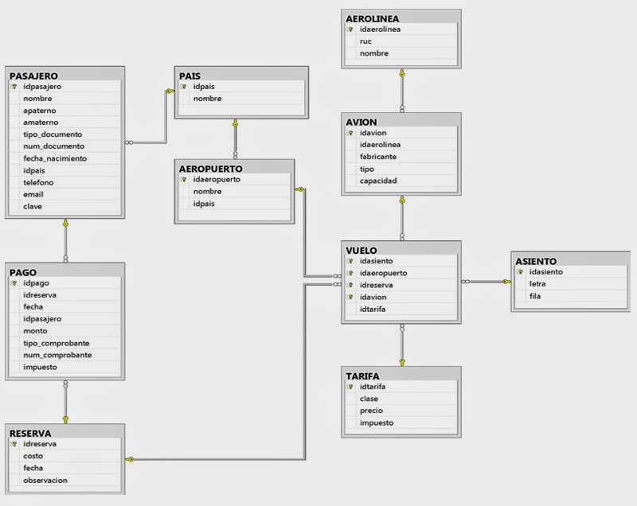
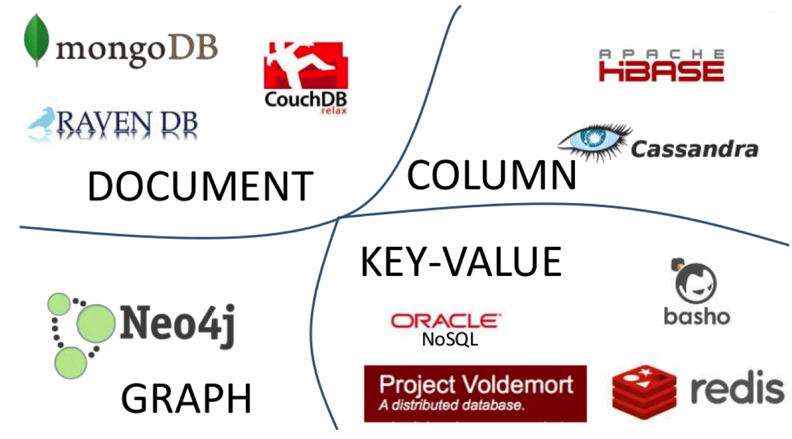
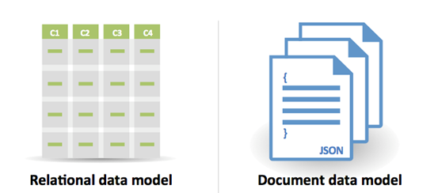
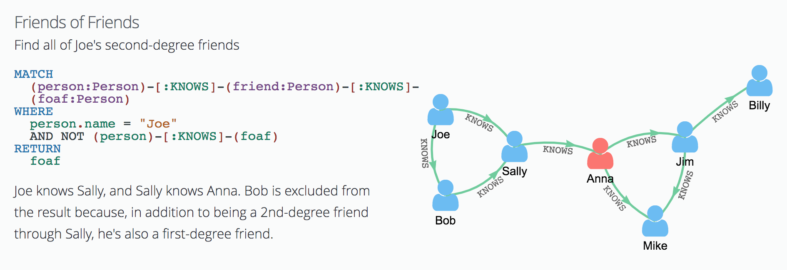
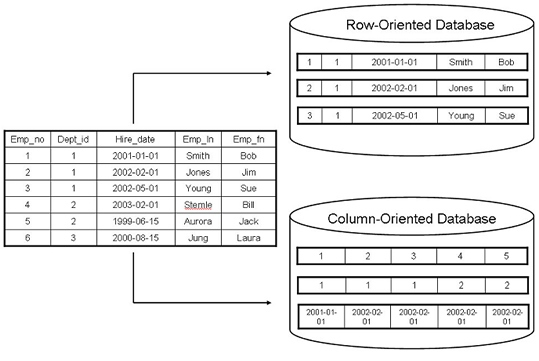
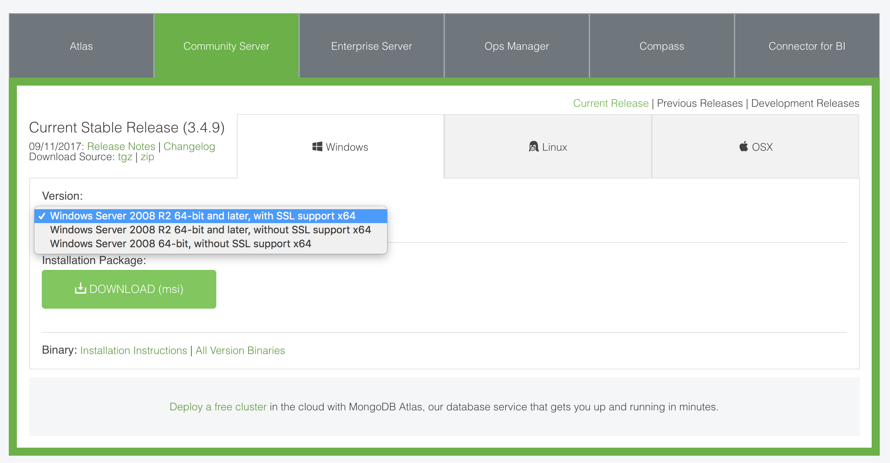

# Base de datos

## ¿Qué es una base de datos?
* Una base de datos es una colección de datos organizados según un determinado criterio
* Estos datos se pueden leer, crear, actualizar y borrar
* También existen motores de base de datos que nos permiten hacer todas estas operaciones de forma más fácil

### Tipos de base de datos
* Existen distintos tipos de bases de datos que se utilizan para solucionar distintos tipos de problemas
* Dentro de la gran familias de bases de datos podemos encontrar las del tipo base de datos relacionales y las no relacionales
* Las bases de datos relacionales se conocen generalmente como las SQL
* Las no relacionales se conocen como NoSQL
* Cada tipo de base de datos tiene beneficios y contras a la hora de almacenar, leer, actualizar o borar los datos

### Bases de datos relacional
> La base de datos relacional (BDR) es un tipo de base de datos (BD) que cumple con el modelo relacional

* Desde su definición vemos que una base de datos puede ser [relacional](https://es.wikipedia.org/wiki/Base_de_datos_relacional) si cumple con algo conocido como el [modelo relacional](https://es.wikipedia.org/wiki/Modelo_relacional)

> El modelo relacional es un modelo de datos basado en la lógica de predicados y en la teoría de conjuntos. Su idea fundamental es el uso de relaciones. Estas relaciones podrían considerarse en forma lógica como conjuntos de datos llamados tuplas. Pensamos cada relación como si fuese una tabla que está compuesta por registros (cada fila de la tabla sería un registro o "tupla") y columnas (también llamadas "campos").

* En la definición de modelo relacional nos podemos quedar con la idea de tablas que tienen columnas para describir los datos que están relacionados entre si.
#### Ejemplo modelo relacional:


* Para que sea modelo relacional debe cumplir con los [siguientes requisitos](https://es.wikipedia.org/wiki/12_reglas_de_Codd)
* Entre los motores de bases de datos relacionales más conocidas encontramos a [SQL Server](https://www.microsoft.com/es-es/sql-server/sql-server-2016), [MySQL](https://www.mysql.com/) y [PostgreSQL](https://www.postgresql.org/) entre otras
* Estos motores de base de datos soporta el [lenguaje SQL](https://es.wikipedia.org/wiki/SQL) (Structured Query Language) para realizar consultas
* Este modelo de datos es el más utilizado en la actualidad
* Para completar nuestra formación como profesionales está muy bueno incorporar conocimientos sobre este tipo de bases de datos
* Uno de los grandes beneficios que tiene este tipo de motores de base de datos es poder realizar [operaciones atómicas](https://es.wikipedia.org/wiki/Atomicidad)
* Evita tener datos repetidos
* Escala de manera vertical
* Para aprender más sobre SQL pueden ingresar a los sitios de:
  * [Fundamentos SQL](http://pedrobeltrancanessa-biblioteca.weebly.com/uploads/1/2/4/0/12405072/fundamentos_de_sql_3edi_oppel.pdf)
  * [Khan Academy (inglés)](https://www.khanacademy.org/computing/computer-programming/sql)
  * [W3 Schools (inglés)](https://www.w3schools.com/sql/)

### Modelo NoSQL
* Se conoce como [NoSQL (Not Only SQL)](https://es.wikipedia.org/wiki/NoSQL) al grupo de bases de datos que no son relacionales
* Dentro de esta clasificación se encuentran las bases de clave/valor, orientadas a documentos, grafos, de grandes columnas

* Este tipo de bases de datos escala de forma horizontal
* Podemos utilizar muchas máquinas chiquitas para crecer y satisfacer las necesidades de los negocios actuales


#### Clave/valor
* Las bases de datos de `clave/valor` guardan valores en formato de diccionario o hash utilizando una clave como índice y su valor. 


#### Orientadas a documentos
* Las base de datos `orientadas a documentos` es bastante parecída a las de `clave/valor`.
* La diferencia recide principalmente en en la complejidad del modelo de dato
* Clave/valor tiene un modelo de lo más simple


* Documento puede tener un modelo de documento complejo
* Muchos de estos motores utilizan JSON/BSON para guardar los datos

* Entre los motores más conocidos de este tipo se encuentra MongoDB

#### Grafos
* Estas bases de datos utilizan el modelo de Grafos
* Se especializan en relaciones
* Las podemos utilizar por ejemplo para guardar puntos de un camino, relaciones de amigos, familia, o cualquier tipo de dato que represente alguna relación
* Entre los motores más conocidos de este tipo se encuentra Neo4j



#### Grandes columnas/BigTable
* Este tipo de familia de bases de datos está orientada a grandes cantidades de datos
* Lo datos son almacenados en columnas
* En una columna tiene múltiples datos
* Entre los motores más conocidos de este tipo se encuentra Cassandra o HBase


* Podemos informarnos más sobre las diferencias entre SQL y NoSQL en el [siguiente link](https://blog.pandorafms.org/es/nosql-vs-sql-diferencias-y-cuando-elegir-cada-una/)

## MongoDB
* MongoDB es una base NoSQL orientada a documentos
* Permite guardar documentos en formato de JSON
* Tiene esquema flexible, es decir que podemos cambiar la estructura de nuestros documentos sin ningún problema
* MongoDB está preparado para escalar fácilmente de manera horizontal
* Dado que aprendimos ECMAScript vamos a utilizar un motor de base de datos que nos permite seguir utilizando este lenguaje para guardar nuestros datos

### Instalar MongoDB
* Para instalar MongoDB primero tenemos que descargar el [instalador desde su sitio](https://www.mongodb.com/download-center#community)
* Vamos a elegir la versión de Community Server
* Seleccionamos Windows
* Elegimos la versión Windows Server 2008 R2 64-bits and later, with SSL support x64
* Hacer click en el botón de descargar



* Luego de terminar con la descarga ejecutamos el instalador e instalamos la versión completa de MongoDB siguiendo todos los pasos que nos pide
* El instalador instala MongoDB en la siguiente ruta `C:\Program Files\MongoDB\Server\3.4\.`
* En este caso la versión es `3.4` y la ruta puede cambiar según cambie la versión de MongoDB
* MongoDB no tiene dependencias de otras librerías por lo cual se puede ejecutar tanto desde la carpeta donde está instalado como desde cualquier otro lado del sistema operativo

### Configurar el ambiente de MongoDB
* MongoDB necesita que le configuremos un directorio donde guardar todos los datos
* Por defecto MongoDB utiliza la carpeta `\data\db` de donde se levanta el servidor
* Vamos a crear esta carpeta para configurar los datos

```bash
C:\> md \data\db
```

* Al levantar el servidor se puede especificar un parámetro llamado `--dbpath` con la ruta absoluta a donde queremos almacenar los datos

```bash
"C:\Program Files\MongoDB\Server\3.4\bin\mongod.exe" --dbpath d:\test\mongodb\data
```

* Para poder acceder a los comandos de MongoDB desde cualquier lado tenemos que configurar una variable de entorno en el sistema operativo

#### Windows 10 y Windows 8
* En Buscar, busque y seleccione: Sistema (Panel de control)
* Haga clic en el enlace Configuración avanzada del sistema.
* Haga clic en Variables de entorno. En la sección Variables del sistema, busque la variable de entorno PATH y selecciónela. Haga clic en Editar. Si no existe la variable de entorno PATH, haga clic en Nuevo.
* En la ventana Editar la variable del sistema (o Nueva variable del sistema), debe especificar el valor de la variable de entorno PATH. Haga clic en Aceptar. Cierre todas las demás ventanas haciendo clic en Aceptar.

#### Windows 7
* Desde el escritorio, haga clic con el botón derecho del mouse en el icono de la computadora.
* Seleccione Propiedades en el menú contextual.
* Haga clic en el enlace Configuración avanzada del sistema.
* Haga clic en Variables de entorno. En la sección Variables del sistema, busque la * variable de entorno PATH y selecciónela. Haga clic en Editar. Si no existe la variable de entorno PATH, haga clic en Nuevo.
* En la ventana Editar la variable del sistema (o Nueva variable del sistema), debe especificar el valor de la variable de entorno PATH. Haga clic en Aceptar. Cierre todas las demás ventanas haciendo clic en Aceptar.

* Ahora ya podemos agregar la nueva ruta de MongoDB a la configuración del PATH
* Tener en cuenta que los datos en PATH se separan utilizando un `;`
* Copiar y agregar la dirección completa a la carpeta `bin` que está dentro del directorio donde se instaló MongoDB

```bash
C:\Program Files\MongoDB\Server\3.4\bin
```

* Gracias a esta configuración ahora podemos ejecutar MongoDB utilizando sus comandos sin tener que escribir la ruta absoluta al directorio donde esta instalado
* Para saber más sobre las variables de entorno pueden leer el [siguiente documento](https://es.wikipedia.org/wiki/Variable_de_entorno)

* En cada guía encontramos los pasos a seguir para instalar MongoDB en los distintos sistemas operativos
  * [Mac](https://docs.mongodb.com/manual/tutorial/install-mongodb-on-os-x/)
  * [Linux](https://docs.mongodb.com/manual/tutorial/install-mongodb-on-linux/)


### Levantar una instancia de mongod
* Para levantar el servidor de MongoDB tenemos que correr el siguiente script según nuestro sistema operativo
* En windows:
```bash
mongod.exe
```
* En Mac/Linux:
```bash
mongod.exe
```

* Al levantar el server nos da información sobre la configuración de esta instancia
* Nos informa el lugar donde guarda los datos `/data/db`
* El tipo de motor que utiliza que en este caso se llama `wiredTiger`
* Y también el purto donde está corriendo MongoDB que por defecto es `27017`

```bash
[initandlisten] Detected data files in /data/db created by the 'wiredTiger' storage engine, so setting the active storage engine to 'wiredTiger'
I NETWORK  [thread1] waiting for connections on port 27017
```

### Presentar el shell
* Para poder interactuar con el servidor tenemos que iniciar un `cliente/shell` de MongoDB 
* Ejecutamos el siguiente comando según el sistema operativo:

* Para Windows:
```bash
mongo.exe
```
* En Mac/Linux:
```bash
mongo
```

* Al conectarnos vemos una descripción similar a la siguiente:

```bash
MongoDB shell version v3.4.2
connecting to: mongodb://127.0.0.1:27017
MongoDB server version: 3.4.2
>
```

* El cliente nos informa que se está conectando al servidor que está en `mongodb://127.0.0.1:27017`
* También nos muestra las versiones del cliente y servidor (`v3.4.2`)
* Para poder utilizar MongoDB tenemos que tener levantado el servidor por un lado y si queremos hacer consultas o ver los datos podemos levantar el cliente
* Este cliente de MongoDB es una consola de JavaScript por lo cual podemos ejecutar código de la siguiente forma

```bash
> 2 + 2
4
```

* El primer comando que vamos a ejecutar es `help` para obtener la lista de comandos que podemos ejecutar y la descripción de como funcionan

```bash
> help
	db.help()                    help on db methods
	db.mycoll.help()             help on collection methods
	sh.help()                    sharding helpers
	rs.help()                    replica set helpers
	help admin                   administrative help
	help connect                 connecting to a db help
	help keys                    key shortcuts
	help misc                    misc things to know
	help mr                      mapreduce

	show dbs                     show database names
	show collections             show collections in current database
	show users                   show users in current database
	show profile                 show most recent system.profile entries with time >= 1ms
	show logs                    show the accessible logger names
	show log [name]              prints out the last segment of log in memory, 'global' is default
	use <db_name>                set current database
	db.foo.find()                list objects in collection foo
	db.foo.find( { a : 1 } )     list objects in foo where a == 1
	it                           result of the last line evaluated; use to further iterate
	DBQuery.shellBatchSize = x   set default number of items to display on shell
	exit                         quit the mongo shell
```

* Existe un comando llamado `show dbs` que nos muestra las bases de datos que tenemos en esta instancia

```bash
> show dbs
local  0.000GB
test  0.000GB
```

* Para saber en que base estamos podemos tipear `db`
* Por defecto MongoDB al ingresar a la consola utilizando el comando `mongo` selecciona la base de datos test

```bash
> db
test
>
```

* MongoDB tiene bases de datos
* Las bases de datos tienen colecciones
* Una colección es donde guardamos nuestros documentos agrupados por un determinado criterio
* Para acceder a una base de datos y una colección se crea un namespace de la siguiente manera

```bash
basededatos.coleccion
```

* Es decir que si quiero tener una base de datos llamada `apple` y una colección llamada `products` puedo acceder a los datos de la siguiente manera

```bash
apple.products
```

* Para poder crear una base de datos utilizamos el comando `use` y el nombre de la base de datos

```bash
use apple
switched to db apple
```

* El comando `use` nos permite tanto crear una nueva base de datos si no existe como también cambiarnos a otra base de datos que queremos utilizar
* MongoDB crea las bases de datos y colecciones de forma `lazzy`, esto significa que realmente no guarda las bases de datos o colecciones hasta que no tiene datos adentro
* Igual mientras no tenemos datos igual nos deja usar la base de datos y colección
* Al cambiar o crear de base de datos MongoDB nos avisa que cambia la referencia de `db` a otra base `switched to db blog`

```bash
> db
apple
```

### Crear un documento
* Para crear un documento vamos a utilizar el método `insertOne`
* Este método acepta un objeto de JSON como parámetro que representa el documento que queremos insertar en la colección
* Para establecer en que colección lo queremos insertar podemos utilizar la variable `db` y el nombre de la colección

```bash
> db.products.insertOne({"name": "MacBook"})
{
	"acknowledged" : true,
	"insertedId" : ObjectId("59c6eae6eb2fe8bf77e9c391")
}
```

* Al insertar el documento vemos que MongoDB nos da una respuesta
* `"acknowledged" : true` significa que se pudo insertar correctamente el documento
* `"insertedId" : ObjectId("59c6eae6eb2fe8bf77e9c391")` Al insertar un nuevo documento MongoDB automáticamente crea un ObjectId que representa de forma única a este documento
* MongoDB agrega una propiedad al documento con el nombre de `_id` al crear un documento
* ObjectId es un tipo de dato que soporta MongoDB
* Vamos a insertar algunos documentos más:

```bash
> db.products.insertOne({"name": "MacBook Air"})
{
	"acknowledged" : true,
	"insertedId" : ObjectId("59c6ec10eb2fe8bf77e9c392")
}

> db.products.insertOne({"name": "MacBook Pro"})
{
	"acknowledged" : true,
	"insertedId" : ObjectId("59c6ec1eeb2fe8bf77e9c393")
}
```

* MongoDB ya guardó la base y colección dado que ya tenemos datos en la base de datos `apple` y en la colección `products`
* Para poder ver las colecciones de una base de datos utilizamos `show collections`

```bash
> show collections
products
```

* También podemos ver que se creo la base de datos apple con `show dbs`

```bash
> show dbs
apple
```

* Al tener creada la base de datos podemos ingresar directamente desde el comando `mongo` de la siguiente forma:
* El comando `mongo` acepta el nombre de una base de datos a la cual nos queremos comunicar

```bash
mongo apple
> db
apple
```

#### Prácticas
[Ejercicio 1](../ejercicios/consignas/node/ej1.md)

### Mostrar el contenido de una colección
* Usando el comando `find` buscamos un documento en la base de datos
* Si no le pasamos ningún parámetro nos retorna los documentos que tiene la colección

```bash
> db.products.find()
{ "_id" : ObjectId("59c6eae6eb2fe8bf77e9c391"), "name" : "MacBook" }
{ "_id" : ObjectId("59c6ec10eb2fe8bf77e9c392"), "name" : "MacBook Air" }
{ "_id" : ObjectId("59c6ec1eeb2fe8bf77e9c393"), "name" : "MacBook Pro" }
```

* En este caso tenemos ya insertados 3 documentos en nuestra base de datos
* Cada documento tiene una propiedad `_id` único que lo identifica
* Todos los documentos tienen una propiedad `name`

### Buscar un documento
* El comando `find` acepta como primer parámetro un objeto con las propiedades que queremos buscar en la base de datos
* Si le pasamos un objeto vacío busca todos los documentos como hasta ahora

```bash
> db.products.find({})
{ "_id" : ObjectId("59c6eae6eb2fe8bf77e9c391"), "name" : "MacBook" }
{ "_id" : ObjectId("59c6ec10eb2fe8bf77e9c392"), "name" : "MacBook Air" }
{ "_id" : ObjectId("59c6ec1eeb2fe8bf77e9c393"), "name" : "MacBook Pro" }
```

* Si queremos buscar por un criterio, por ejemplo por la propiedad `name` podemos hacerlo de la siguiente forma

```bash
> > db.products.find({ "name": "MacBook" })
{ "_id" : ObjectId("59c6eae6eb2fe8bf77e9c391"), "name" : "MacBook" }
```

* En este caso tenemos un sólo documento que cumple con esta condición por lo cual MongoDB sólo retorna el documento encontrado
* Podemos buscar por cualquier campo de un documento

#### Prácticas
[Ejercicio 2](../ejercicios/consignas/node/ej2.md)

## Cursor
* El resultado que retorna find es un tipo de objeto llamado `cursor`
* Podemos asignar la respuesta de `find` a una variable
* Dado que no le pasamos parámetro esta búsqueda retorna todos los documentos que tenemos en la colección

```bash
> var cursor = db.products.find()
```

* Para saber si el cursor tiene documentos que mostrar utilizamos el método `hasNext()`
* Este método retorna un valor boolean

```bash
> cursor.hasNext()
true
```

* Al ser un cursor el restulado podemos llamar al método `next` para obtener el próximo resultado

```bash
> cursor.next()
{ "_id" : ObjectId("59c6eae6eb2fe8bf77e9c391"), "name" : "MacBook" }
> cursor.next()
{ "_id" : ObjectId("59c6ec10eb2fe8bf77e9c392"), "name" : "MacBook Air" }
> cursor.next()
{ "_id" : ObjectId("59c6ec1eeb2fe8bf77e9c393"), "name" : "MacBook Pro" }
```

* Podemos llamar a `next` tres veces ya que es la cantidad de documentos que retorna el llamado a `find`
* Podemo preguntar si le quedan más documentos al cursor utilizando de nuevo `hasNext()`

```bash
> cursor.hasNext()
false
```

#### Prácticas
[Ejercicio 3](../ejercicios/consignas/node/ej3.md)

### Insertar Múltiples documentos
* Para insertar un documento utilizamos el método `insertOne`
* Si queremos crear varios documentos al mismo tiempo utilizamos `insertMany`
* `insertMany` acepta como primer párámetro una colección (array) de documentos en formato JSON
```bash
> db.products.insertMany([
	{"name": "iPhone X"},
	{"name": "iPhone 8"},
	{"name": "iPhone 7"},
	{"name": "iPhone 6s"},
	{"name": "iPhone SE"},
])
{
	"acknowledged" : true,
	"insertedIds" : [
		ObjectId("59c7c6dc767962b210e29f9a"),
		ObjectId("59c7c6dc767962b210e29f9b"),
		ObjectId("59c7c6dc767962b210e29f9c"),
		ObjectId("59c7c6dc767962b210e29f9d"),
		ObjectId("59c7c6dc767962b210e29f9e")
	]
}
```

* Si ejecutamos un `find` sobre la colección `products` obtenemos la lista de todos los documentos insertados hasta el momento

```bash
> db.products.find()
{ "_id" : ObjectId("59c6eae6eb2fe8bf77e9c391"), "name" : "MacBook" }
{ "_id" : ObjectId("59c6ec10eb2fe8bf77e9c392"), "name" : "MacBook Air" }
{ "_id" : ObjectId("59c6ec1eeb2fe8bf77e9c393"), "name" : "MacBook Pro" }
{ "_id" : ObjectId("59c7c6dc767962b210e29f9a"), "name" : "iPhone X" }
{ "_id" : ObjectId("59c7c6dc767962b210e29f9b"), "name" : "iPhone 8" }
{ "_id" : ObjectId("59c7c6dc767962b210e29f9c"), "name" : "iPhone 7" }
{ "_id" : ObjectId("59c7c6dc767962b210e29f9d"), "name" : "iPhone 6s" }
{ "_id" : ObjectId("59c7c6dc767962b210e29f9e"), "name" : "iPhone SE" }
```

* En este ejemplo insertamos múltiples documentos
* Obtenemos una respuesta similar a `insertOne` pero ahora MongoDB nos retorna todos los ObjectId que creo para cada uno de los documentos

#### Prácticas
[Ejercicio 4](../ejercicios/consignas/node/ej4.md)

## Borrar una colección
* Para borar una colección utilizamos el método `drop`

```bash
> db.products.drop()
true
> show collections
>
```

* Al ejecutar el método `drop` sobre una colección borramos todo su contenido

## Borrar una base de datos
* Para borrar una base de datos utilizamos el método `dropDatabase`

```bash
show dbs
local  0.000GB
test   0.000GB
apple  0.000GB

> db.dropDatabase()
{ "dropped" : "blog", "ok" : 1 }

> show dbs
local  0.000GB
test   0.000GB
```

* Al llamar a `db.dropDatabase()` le decimos a MongoDB que borre la base de datos seleccionada en `db`
* Volvemos a crear nuestra base de datos `apple` e insertamos todos los documentos anteriores

```bash
> use apple
switched to db apple
> db.products.insertMany([
	{ "name" : "MacBook" },
	{ "name" : "MacBook Air" },
	{ "name" : "MacBook Pro" },
	{ "name" : "iPhone X" },
	{ "name" : "iPhone 8" },
	{ "name" : "iPhone 7" },
	{ "name" : "iPhone 6s" },
	{ "name" : "iPhone SE" }
])
{
	"acknowledged" : true,
	"insertedIds" : [
		ObjectId("59c7ca94767962b210e29fa4"),
		ObjectId("59c7ca94767962b210e29fa5"),
		ObjectId("59c7ca94767962b210e29fa6"),
		ObjectId("59c7ca94767962b210e29fa7"),
		ObjectId("59c7ca94767962b210e29fa8"),
		ObjectId("59c7ca94767962b210e29fa9"),
		ObjectId("59c7ca94767962b210e29faa"),
		ObjectId("59c7ca94767962b210e29fab")
	]
}

> db.products.find()
{ "_id" : ObjectId("59c7cacc767962b210e29fac"), "name" : "MacBook" }
{ "_id" : ObjectId("59c7cacc767962b210e29fad"), "name" : "MacBook Air" }
{ "_id" : ObjectId("59c7cacc767962b210e29fae"), "name" : "MacBook Pro" }
{ "_id" : ObjectId("59c7cacc767962b210e29faf"), "name" : "iPhone X" }
{ "_id" : ObjectId("59c7cacc767962b210e29fb0"), "name" : "iPhone 8" }
{ "_id" : ObjectId("59c7cacc767962b210e29fb1"), "name" : "iPhone 7" }
{ "_id" : ObjectId("59c7cacc767962b210e29fb2"), "name" : "iPhone 6s" }
{ "_id" : ObjectId("59c7cacc767962b210e29fb3"), "name" : "iPhone SE" }
```

* Podemos saber la cantidad de documentos que retorna esta búsqueda utilizando el método `count`

```bash
> db.products.find().count()
8
```

#### Prácticas
[Ejercicio 5](../ejercicios/consignas/node/ej5.md)

## Importar datos
* Para importar datos de manera fácil utilizamos la herramienta `mongoimport`
* Este comando acepta los siguientes parámetros:
	* **--db**: nombre de la base de datos
	* **--collection**: nombre de la colección
	* **--drop**: si configuramos este parámetro MongoDB borra todo el contenido de la colección antes de importar los nuevos datos
	* **--file**: especifíca el nombre del archivo JSON con los documentos que queremos importar
* Importemos datos en la base de datos de apple, en la colección products utilizando el archivo productos.json

```bash
mongoimport --db apple --collection products --drop --file productos.json
```

* En este ejemplo importamos 21 productos en la colección products de la base de datos apple

```bash
> db.products.find()
{ "_id" : ObjectId("59c80b935d070ae64857c720"), "name" : "MacBook", "price" : 1299, "stock" : 10, "picture" : "macbook.jpeg", "categories" : [ "macbook", "notebook" ] }
{ "_id" : ObjectId("59c80b935d070ae64857c721"), "name" : "Mac Pro", "price" : 2999, "stock" : 2, "picture" : "macpro.png", "categories" : [ "computer" ] }
{ "_id" : ObjectId("59c80b935d070ae64857c722"), "name" : "Mac mini", "price" : 499, "stock" : 20, "picture" : "macmini.png", "categories" : [ "computer" ] }
{ "_id" : ObjectId("59c80b935d070ae64857c723"), "name" : "MacBook Air", "price" : 999, "stock" : 5, "picture" : "macbookair.jpeg", "categories" : [ "macbook", "notebook" ] }
{ "_id" : ObjectId("59c80b935d070ae64857c724"), "name" : "MacBook Pro", "price" : 2399, "stock" : 3, "picture" : "mbptouch.jpeg", "categories" : [ "macbook", "notebook" ] }
{ "_id" : ObjectId("59c80b935d070ae64857c725"), "name" : "iMac", "price" : 1799, "stock" : 8, "picture" : "imac.jpeg", "categories" : [ "computer" ] }
{ "_id" : ObjectId("59c80b935d070ae64857c726"), "name" : "iPad Pro", "price" : 649, "stock" : 6, "picture" : "ipadpro.png", "categories" : [ "ipad", "tablet" ] }
{ "_id" : ObjectId("59c80b935d070ae64857c727"), "name" : "iPad", "price" : 329, "stock" : 30, "picture" : "ipad.jpeg", "categories" : [ "ipad", "tablet" ] }
{ "_id" : ObjectId("59c80b935d070ae64857c728"), "name" : "iPad mini 4", "price" : 399, "stock" : 14, "picture" : "ipadmini.jpeg", "categories" : [ "ipad", "tablet" ] }
{ "_id" : ObjectId("59c80b935d070ae64857c729"), "name" : "iPhone X", "price" : 999, "stock" : 200, "picture" : "iphonex.png", "categories" : [ "iphone", "phone" ] }
{ "_id" : ObjectId("59c80b935d070ae64857c72a"), "name" : "iPhone 8", "price" : 699, "stock" : 200, "picture" : "iphone8.png", "categories" : [ "iphone", "phone" ] }
{ "_id" : ObjectId("59c80b935d070ae64857c72b"), "name" : "iPhone 7", "price" : 549, "stock" : 50, "picture" : "iphone7.png", "categories" : [ "iphone", "phone" ] }
{ "_id" : ObjectId("59c80b935d070ae64857c72c"), "name" : "iPhone 6s", "price" : 449, "stock" : 20, "picture" : "iphone6s.png", "categories" : [ "iphone", "phone" ] }
{ "_id" : ObjectId("59c80b935d070ae64857c72d"), "name" : "iPhone SE", "price" : 349, "stock" : 30, "picture" : "iphonese.png", "categories" : [ "iphone", "phone" ] }
{ "_id" : ObjectId("59c80b935d070ae64857c72e"), "name" : "Apple Watch Series 3", "price" : 329, "stock" : 10, "picture" : "iwatch3.jpeg", "categories" : [ "watch" ] }
{ "_id" : ObjectId("59c80b935d070ae64857c72f"), "name" : "Apple Watch Nike+", "price" : 329, "stock" : 3, "picture" : "iwatchnike.jpeg", "categories" : [ "watch" ] }
{ "_id" : ObjectId("59c80b935d070ae64857c730"), "name" : "Apple Watch Hermès", "price" : 1199, "stock" : 2, "picture" : "iwatchhermes.jpeg", "categories" : [ "watch" ] }
{ "_id" : ObjectId("59c80b935d070ae64857c731"), "name" : "Apple Watch Edition", "price" : 1299, "stock" : 6, "picture" : "iwatchceramic.jpeg", "categories" : [ "watch" ] }
{ "_id" : ObjectId("59c80b935d070ae64857c732"), "name" : "Apple Watch Series 1", "price" : 249, "stock" : 20, "picture" : "iwatch.jpeg", "categories" : [ "watch" ] }
{ "_id" : ObjectId("59c80b935d070ae64857c733"), "name" : "Apple TV 4K", "price" : 179, "stock" : 300, "picture" : "appletv4k.jpeg", "categories" : [ "tv" ] }
```

* Los documentos importados tienen algunas propiedades más que los documentos que veníamos utilizando para productos
* Para ver mejor el listado de documentos y sus propiedades utilizamos el comando `pretty`

```bash
> db.products.find().pretty()
db.products.find().pretty()
{
	"_id" : ObjectId("59c80b935d070ae64857c720"),
	"name" : "MacBook",
	"price" : 1299,
	"stock" : 10,
	"picture" : "macbook.jpeg",
	"categories" : [
		"macbook",
		"notebook"
	]
}
```

* Por cuestiones de cantidad de documentos sólo mostramos en este ejemplo la salida del primer documento
* Vemos que se puede ver mejor el documento utilizando el método `pretty` para mostrar los resultados de una búsqueda

#### Prácticas
[Ejercicio 6](../ejercicios/consignas/node/ej6.md)

## Más sobre el método find
* Como vimos utilizamos el método `find` para buscar documentos en una colección
* Si no le pasamos parámetros o pasamos un objeto vacío este método retorna todos los documentos de la colección
* Podemos establecer un criterio de búsqueda como primer parámetro

```bash
> db.products.find({"name": "iMac"})
{ "_id" : ObjectId("59c80b935d070ae64857c725"), "name" : "iMac", "price" : 1799, "stock" : 8, "picture" : "imac.jpeg", "categories" : [ "computer" ] }
```

* También podemos especificar otros criterios de búsqueda de la siguiente manera:

```bash
> db.products.find({"name": "iMac", "price" : 1799})
{ "_id" : ObjectId("59c80b935d070ae64857c725"), "name" : "iMac", "price" : 1799, "stock" : 8, "picture" : "imac.jpeg", "categories" : [ "computer" ] }
```

* En este caso estamos buscando por dos criterios, que name sea "iMac" y que el precio sea 1799
* Si cambiamos algunos de estos parámetros limitamos la cantidad de resultados que encontramos
* Por ejemplo si cambiamos el precio buscado no obtenemos un documento

```bash
> db.products.find({"name": "iMac", "price" : 1800})
```

* En este caso no se muestran resultados por no tener documentos que cumplan con ambos criterios
* También podemos buscar documentos utilizando las propiedades que son del tipo array
* Vamos a buscar todos los documentos que tienen la categoría `macbook` y `notebook`
```bash
> db.products.find({"categories": ["macbook", "notebook"]})
{ "_id" : ObjectId("59c80b935d070ae64857c720"), "name" : "MacBook", "price" : 1299, "stock" : 10, "picture" : "macbook.jpeg", "categories" : [ "macbook", "notebook" ] }
{ "_id" : ObjectId("59c80b935d070ae64857c723"), "name" : "MacBook Air", "price" : 999, "stock" : 5, "picture" : "macbookair.jpeg", "categories" : [ "macbook", "notebook" ] }
{ "_id" : ObjectId("59c80b935d070ae64857c724"), "name" : "MacBook Pro", "price" : 2399, "stock" : 3, "picture" : "mbptouch.jpeg", "categories" : [ "macbook", "notebook" ] }
```

* Al utilizar arrays y especificarlos de esta forma MongoDB sólo retorna los documentos que cumplen con todos los elementos del array
* Si sólo buscamos por el criterio de `macbook` no obtenemos ningún resultado ya que los documentos tienen más categorías que tan solo la buscada

```bash
> db.products.find({"categories": ["macbook"]})
```

* Si queremos buscar en un array por un sólo criterio hacemos la búsqueda como si fuera un campo normal

```bash
> db.products.find({"categories": "macbook"})
{ "_id" : ObjectId("59c80b935d070ae64857c720"), "name" : "MacBook", "price" : 1299, "stock" : 10, "picture" : "macbook.jpeg", "categories" : [ "macbook", "notebook" ] }
{ "_id" : ObjectId("59c80b935d070ae64857c723"), "name" : "MacBook Air", "price" : 999, "stock" : 5, "picture" : "macbookair.jpeg", "categories" : [ "macbook", "notebook" ] }
{ "_id" : ObjectId("59c80b935d070ae64857c724"), "name" : "MacBook Pro", "price" : 2399, "stock" : 3, "picture" : "mbptouch.jpeg", "categories" : [ "macbook", "notebook" ] }
```

* De esta forma obtenemos todos los documentos que tienen la categoría `macbook`
* Utilizamos `[]` en nuestro filtro sólo cuando queremos un resultado exacto para los elementos array

#### Prácticas
[Ejercicio 7](../ejercicios/consignas/node/ej7.md)

## Proyección
* Hasta ahora al utilizar el método `find` obtenemos todos los documentos buscados con todas sus propiedades
* En algunos casos queremos limitar la cantidad de propiedades que mostramos sobre un documento en un resultado del método `find`
* Este criterio en MongoDB se conoce como proyección
* El método `find` acepta un segundo valor que también es un objeto con los nombres de los campos que queremos incluír en los documentos retornados
* Por ejemplo podemos lista sólo el nombre de los productos que tienen la categoría `macbook` de la siguiente forma

```bash
> db.products.find({"categories": "macbook"}, { "name": 1})
{ "_id" : ObjectId("59c80b935d070ae64857c720"), "name" : "MacBook" }
{ "_id" : ObjectId("59c80b935d070ae64857c723"), "name" : "MacBook Air" }
{ "_id" : ObjectId("59c80b935d070ae64857c724"), "name" : "MacBook Pro" }
```

* En este ejemplo vemos que al especificar una propiedad como proyectada se utiliza en la respuesta de la búsqueda
* Utilizamos `1` para decirle a MongoDB que esta propiedad está activa
* Podemos utilizar `0` para decirle a MongoDB que no queremos proyectar una propiedad en particular
* MongoDB siempre retorna la propiedad `_id`
* Si queremos ignorar esa propiedad lo podemos hacer utilizando `0` en la proyección para esa propiedad de la siguiente manera:

```bash
> db.products.find({"categories": "macbook"}, { "name": 1, "_id": 0})
{ "name" : "MacBook" }
{ "name" : "MacBook Air" }
{ "name" : "MacBook Pro" }
```

* Podemos utilizar esta técnica para excluir propiedades
* Por ejemplo si queremos excluir las propiedades stock, precio y picture lo podemos hacer de la siguiente manera:

```bash
> db.products.find({"categories": "macbook"}, {"price":0, "stock":0, "picture": 0})
{ "_id" : ObjectId("59c80b935d070ae64857c720"), "name" : "MacBook", "categories" : [ "macbook", "notebook" ] }
{ "_id" : ObjectId("59c80b935d070ae64857c723"), "name" : "MacBook Air", "categories" : [ "macbook", "notebook" ] }
{ "_id" : ObjectId("59c80b935d070ae64857c724"), "name" : "MacBook Pro", "categories" : [ "macbook", "notebook" ] }
```

* Utilizamos entonces la proyección para limitar la cantidad de propiedades que mostramos para cada documento encontrado

#### Prácticas
[Ejercicio 8](../ejercicios/consignas/node/ej8.md)

## Operadores
* Los operadores nos permiten realizar búsquedas de forma más puntual
* Podes conocer la lista completa de operadores en el [sitio de MongoDB](https://docs.mongodb.com/manual/reference/operator/query/)

### Comparación
* Hasta ahora realizamos query's utilizando igualdad
* Si queremos buscar por un valor específico estamos utilizando el operador `$eq`

```bash
> db.products.find( { "price": { $eq: 449 } })
{ "_id" : ObjectId("59c80b935d070ae64857c72c"), "name" : "iPhone 6s", "price" : 449, "stock" : 20, "picture" : "iphone6s.png", "categories" : [ "iphone", "phone" ] }
```

* En este caso es lo mismo que utilizar;

```bash
> db.products.find( { "price": 449 })
{ "_id" : ObjectId("59c80b935d070ae64857c72c"), "name" : "iPhone 6s", "price" : 449, "stock" : 20, "picture" : "iphone6s.png", "categories" : [ "iphone", "phone" ] }
```

* Existen otros operadores como `$gt` que evalúa resultados que son más grandes que un criterio
* `$lt` evalúa resultados que son más chicos que el criterio estabecido

```bash
> db.products.find( { "price": { $gt: 1500} })
{ "_id" : ObjectId("59c80b935d070ae64857c721"), "name" : "Mac Pro", "price" : 2999, "stock" : 2, "picture" : "macpro.png", "categories" : [ "computer" ] }
{ "_id" : ObjectId("59c80b935d070ae64857c724"), "name" : "MacBook Pro", "price" : 2399, "stock" : 3, "picture" : "mbptouch.jpeg", "categories" : [ "macbook", "notebook" ] }
{ "_id" : ObjectId("59c80b935d070ae64857c725"), "name" : "iMac", "price" : 1799, "stock" : 8, "picture" : "imac.jpeg", "categories" : [ "computer" ] }
```

* En este caso buscamos productos cuyo precio es más grande que 1500
* También podemos buscar por precios más chicos

```bash
> db.products.find( { "price": { $lt: 300} })
{ "_id" : ObjectId("59c80b935d070ae64857c732"), "name" : "Apple Watch Series 1", "price" : 249, "stock" : 20, "picture" : "iwatch.jpeg", "categories" : [ "watch" ] }
{ "_id" : ObjectId("59c80b935d070ae64857c733"), "name" : "Apple TV 4K", "price" : 179, "stock" : 300, "picture" : "appletv4k.jpeg", "categories" : [ "tv" ] }
{ "_id" : ObjectId("59c80b935d070ae64857c734"), "name" : "Apple TV", "price" : 149, "stock" : 100, "picture" : "appletv.jpeg", "categories" : [ "tv" ] }
```

* Todos estos productos cuestan menos de 300
* Si queremos incluír el valor buscado dentro de los resultados podemos utilizar los operadores `$lte` y `$gte`
* Con estos operadores no buscamos por un valor específico sino por la relación que tiene el valor buscado con el criterio aplicado
* También podemos realizar búsquedas utilizando un rango de la siguiente manera

```bash
> db.products.find( { "price": { $lte: 1000, $gte: 300} })
{ "_id" : ObjectId("59c80b935d070ae64857c722"), "name" : "Mac mini", "price" : 499, "stock" : 20, "picture" : "macmini.png", "categories" : [ "computer" ] }
{ "_id" : ObjectId("59c80b935d070ae64857c723"), "name" : "MacBook Air", "price" : 999, "stock" : 5, "picture" : "macbookair.jpeg", "categories" : [ "macbook", "notebook" ] }
{ "_id" : ObjectId("59c80b935d070ae64857c726"), "name" : "iPad Pro", "price" : 649, "stock" : 6, "picture" : "ipadpro.png", "categories" : [ "ipad", "tablet" ] }
{ "_id" : ObjectId("59c80b935d070ae64857c727"), "name" : "iPad", "price" : 329, "stock" : 30, "picture" : "ipad.jpeg", "categories" : [ "ipad", "tablet" ] }
{ "_id" : ObjectId("59c80b935d070ae64857c728"), "name" : "iPad mini 4", "price" : 399, "stock" : 14, "picture" : "ipadmini.jpeg", "categories" : [ "ipad", "tablet" ] }
{ "_id" : ObjectId("59c80b935d070ae64857c729"), "name" : "iPhone X", "price" : 999, "stock" : 200, "picture" : "iphonex.png", "categories" : [ "iphone", "phone" ] }
{ "_id" : ObjectId("59c80b935d070ae64857c72a"), "name" : "iPhone 8", "price" : 699, "stock" : 200, "picture" : "iphone8.png", "categories" : [ "iphone", "phone" ] }
{ "_id" : ObjectId("59c80b935d070ae64857c72b"), "name" : "iPhone 7", "price" : 549, "stock" : 50, "picture" : "iphone7.png", "categories" : [ "iphone", "phone" ] }
{ "_id" : ObjectId("59c80b935d070ae64857c72c"), "name" : "iPhone 6s", "price" : 449, "stock" : 20, "picture" : "iphone6s.png", "categories" : [ "iphone", "phone" ] }
{ "_id" : ObjectId("59c80b935d070ae64857c72d"), "name" : "iPhone SE", "price" : 349, "stock" : 30, "picture" : "iphonese.png", "categories" : [ "iphone", "phone" ] }
{ "_id" : ObjectId("59c80b935d070ae64857c72e"), "name" : "Apple Watch Series 3", "price" : 329, "stock" : 10, "picture" : "iwatch3.jpeg", "categories" : [ "watch" ] }
{ "_id" : ObjectId("59c80b935d070ae64857c72f"), "name" : "Apple Watch Nike+", "price" : 329, "stock" : 3, "picture" : "iwatchnike.jpeg", "categories" : [ "watch" ] }
```

* En este caso utilizamos el rango de precios que es menor a 1000 y mayor que 300
* También podemos buscar documentos que tienen una propiedad que puede ser uno de varios valores
* Por ejemplo podemos buscar productos que el valor sea 329 o 1199 o 699 utilizando el operador `$in`

```bash
> db.products.find( { "price": { $in: [329, 699, 1199]} })
{ "_id" : ObjectId("59c80b935d070ae64857c727"), "name" : "iPad", "price" : 329, "stock" : 30, "picture" : "ipad.jpeg", "categories" : [ "ipad", "tablet" ] }
{ "_id" : ObjectId("59c80b935d070ae64857c72a"), "name" : "iPhone 8", "price" : 699, "stock" : 200, "picture" : "iphone8.png", "categories" : [ "iphone", "phone" ] }
{ "_id" : ObjectId("59c80b935d070ae64857c72e"), "name" : "Apple Watch Series 3", "price" : 329, "stock" : 10, "picture" : "iwatch3.jpeg", "categories" : [ "watch" ] }
{ "_id" : ObjectId("59c80b935d070ae64857c72f"), "name" : "Apple Watch Nike+", "price" : 329, "stock" : 3, "picture" : "iwatchnike.jpeg", "categories" : [ "watch" ] }
{ "_id" : ObjectId("59c80b935d070ae64857c730"), "name" : "Apple Watch Hermès", "price" : 1199, "stock" : 2, "picture" : "iwatchhermes.jpeg", "categories" : [ "watch" ] }
```

* En este ejemplo vemos que solo obtenemos productos que tengan alguno de los precios buscados

#### Prácticas
[Ejercicio 9](../ejercicios/consignas/node/ej9.md)

### Operadores Lógicos
* Para crear mejores filtros podemos utilizar los operadores lógicos `$or` y `$and`
* Estos operadores funcionan de la misma forma que los operadores lógicos que vimos en ECMAScript 
* Si queremos documento que cumplan con este criterio `Y` este otro criterio entonces utilizamos `$and`
* Si queremos documentos que cumpla con este criterio O este criterio utilizamos el operador `$or`
* Por ejemplo podemos buscar documentos que tienen stock mayor a 100 `Y` precio menor que 400

```bash
> db.products.find({ $and: [{"stock": { $gte: 100}}, {"price": { $lte: 400} }]})
{ "_id" : ObjectId("59c80b935d070ae64857c733"), "name" : "Apple TV 4K", "price" : 179, "stock" : 300, "picture" : "appletv4k.jpeg", "categories" : [ "tv" ] }
{ "_id" : ObjectId("59c80b935d070ae64857c734"), "name" : "Apple TV", "price" : 149, "stock" : 100, "picture" : "appletv.jpeg", "categories" : [ "tv" ] }
```

* También podemos buscar documentos que tienen stock mayor a 100 `O` precio menor que 400

```bash
> db.products.find({ $or: [{"stock": { $gte: 100}}, {"price": { $lte: 400} }]})
{ "_id" : ObjectId("59c80b935d070ae64857c727"), "name" : "iPad", "price" : 329, "stock" : 30, "picture" : "ipad.jpeg", "categories" : [ "ipad", "tablet" ] }
{ "_id" : ObjectId("59c80b935d070ae64857c728"), "name" : "iPad mini 4", "price" : 399, "stock" : 14, "picture" : "ipadmini.jpeg", "categories" : [ "ipad", "tablet" ] }
{ "_id" : ObjectId("59c80b935d070ae64857c729"), "name" : "iPhone X", "price" : 999, "stock" : 200, "picture" : "iphonex.png", "categories" : [ "iphone", "phone" ] }
{ "_id" : ObjectId("59c80b935d070ae64857c72a"), "name" : "iPhone 8", "price" : 699, "stock" : 200, "picture" : "iphone8.png", "categories" : [ "iphone", "phone" ] }
{ "_id" : ObjectId("59c80b935d070ae64857c72d"), "name" : "iPhone SE", "price" : 349, "stock" : 30, "picture" : "iphonese.png", "categories" : [ "iphone", "phone" ] }
{ "_id" : ObjectId("59c80b935d070ae64857c72e"), "name" : "Apple Watch Series 3", "price" : 329, "stock" : 10, "picture" : "iwatch3.jpeg", "categories" : [ "watch" ] }
{ "_id" : ObjectId("59c80b935d070ae64857c72f"), "name" : "Apple Watch Nike+", "price" : 329, "stock" : 3, "picture" : "iwatchnike.jpeg", "categories" : [ "watch" ] }
{ "_id" : ObjectId("59c80b935d070ae64857c732"), "name" : "Apple Watch Series 1", "price" : 249, "stock" : 20, "picture" : "iwatch.jpeg", "categories" : [ "watch" ] }
{ "_id" : ObjectId("59c80b935d070ae64857c733"), "name" : "Apple TV 4K", "price" : 179, "stock" : 300, "picture" : "appletv4k.jpeg", "categories" : [ "tv" ] }
{ "_id" : ObjectId("59c80b935d070ae64857c734"), "name" : "Apple TV", "price" : 149, "stock" : 100, "picture" : "appletv.jpeg", "categories" : [ "tv" ] }
```

* En este segundo caso obtenemos más resultados ya que muchos de los productos cumplen con la condición de stock mayor a 100 y precio menor a 400

#### Prácticas
[Ejercicio 10](../ejercicios/consignas/node/ej10.md)

## Actualizar un documento
* Para actualizar un documento utilizamos el método `updateOne`
* Este método acepta como primer parámetro un criterio de búsqueda como el método `find`
* Como segundo parámetro utilizamos el operador `$set` para establecer todos los cambios que queremos realizar sobre el documento
* Por ejemplo si queremos cambiarle el precio al documento que tiene el nombre `macbook` a 1399 lo podemos hacer de la siguiente manera:

```bash
> db.products.updateOne(
	{ "name": "MacBook"},
	{ $set: { "price": 1399}}
)
{ "acknowledged" : true, "matchedCount" : 1, "modifiedCount" : 1 }
> db.products.find({"name": "MacBook"})
{ "_id" : ObjectId("59c80b935d070ae64857c720"), "name" : "MacBook", "price" : 1399, "stock" : 10, "picture" : "macbook.jpeg", "categories" : [ "macbook", "notebook" ] }
```

* MongoDB actualiza el documento y nos informa el status de la actualización mostrando la cantidad de documentos encontrados que cumplen con el criterio y cuántos fueron actualizados
* Dado que MongoDB tiene un schema flexible podemos establecer una propiedad al documento que no existe sin tener que modificar la estructura del resto de los documentos
* Por ejemplo vamos a agregar la propiedad `prime` al documento que acepta un valor boolean

```bash
> db.products.updateOne(
	{"name": "Mac Pro"},
	{ $set: { "prime": true}}
)
{ "acknowledged" : true, "matchedCount" : 1, "modifiedCount" : 1 }
> db.products.find({"name": "Mac Pro"})
{ "_id" : ObjectId("59c80b935d070ae64857c721"), "name" : "Mac Pro", "price" : 2999, "stock" : 2, "picture" : "macpro.png", "categories" : [ "computer" ], "prime" : true }
```

#### Prácticas
[Ejercicio 11](../ejercicios/consignas/node/ej11.md)

**Práctica adicional**
* MongoDB tiene muchos operadores que nos permiten hacer updates de distintas formas y los podes ver en la [documentación de MongoDB](https://docs.mongodb.com/manual/reference/operator/update-field)
* Mirar la documentación y tratar de entender cómo funcionan los operadores `$inc`, `$currentDate` y `$setOnInsert`

### Actualizar varios documentos y arrays
* Dado que las propiedades pueden ser del tipo array, necesitamos una forma de poder hacer update a los distintos valores que contengan estos tipos de datos
* Existen varios operadores que nos permiten realizar operaciones sobre este tipo de datos
* Podes ver el listado de operadores de array en el [sitio de MongoDB](https://docs.mongodb.com/manual/reference/operator/update-array/)
* Podemos agregar una categoría a un producto utilizando el operador `$push`

```bash
> db.products.updateOne(
	{ "name": "MacBook"},
	{ $push: { "categories": "power"}}
)
{ "acknowledged" : true, "matchedCount" : 1, "modifiedCount" : 1 }
> db.products.find({ "name": "MacBook"}, { "categories": 1, "_id": 0})
{ "categories" : [ "macbook", "notebook", "power" ] }
```

* Al igual que los arrays de ECMAScript podemos utilizar pop para sacar el primer o último elemento de un array
* Acepta el parámetro -1 para remover el primer elemento
* Acepta el parámetro 1 para remover el último elemento

```bash
> db.products.updateOne(
	{ "name": "MacBook"},
	{ $pop: { "categories": 1}}
)
{ "acknowledged" : true, "matchedCount" : 1, "modifiedCount" : 1 }
> db.products.find({ "name": "MacBook"}, { "categories": 1, "_id": 0})
{ "categories" : [ "macbook", "notebook" ] }
```

* Para modificar varios documentos utilizamos el método `updateMany`
* Este nuevo método funciona de la misma forma que `updateOne` pero en lugar de actualizar el primer documento encontrado, actualiza todos los documentos que cumplen con el criterio

```bash
db.products.updateMany(
	{"categories": "macbook"},
	{ $push: { "categories": "power"}}
)
{ "acknowledged" : true, "matchedCount" : 3, "modifiedCount" : 3 }

> db.products.find({"categories": "macbook"})

{ "_id" : ObjectId("59c80b935d070ae64857c720"), "name" : "MacBook", "price" : 1399, "stock" : 10, "picture" : "macbook.jpeg", "categories" : [ "macbook", "notebook", "power" ] }
{ "_id" : ObjectId("59c80b935d070ae64857c723"), "name" : "MacBook Air", "price" : 999, "stock" : 5, "picture" : "macbookair.jpeg", "categories" : [ "macbook", "notebook", "power" ] }
{ "_id" : ObjectId("59c80b935d070ae64857c724"), "name" : "MacBook Pro", "price" : 2399, "stock" : 3, "picture" : "mbptouch.jpeg", "categories" : [ "macbook", "notebook", "power" ] }
```

* Al ejecutar este query vemos que se actualizan 3 documentos
* De la misma forma que agregamos podemos borrar items del array

```bash
> db.products.updateMany(
	{"categories": "macbook"},
	{ $pop: { "categories": 1}}
)
{ "acknowledged" : true, "matchedCount" : 3, "modifiedCount" : 3 }

> db.products.find({"categories": "macbook"})

{ "_id" : ObjectId("59c80b935d070ae64857c720"), "name" : "MacBook", "price" : 1399, "stock" : 10, "picture" : "macbook.jpeg", "categories" : [ "macbook", "notebook" ] }
{ "_id" : ObjectId("59c80b935d070ae64857c723"), "name" : "MacBook Air", "price" : 999, "stock" : 5, "picture" : "macbookair.jpeg", "categories" : [ "macbook", "notebook" ] }
{ "_id" : ObjectId("59c80b935d070ae64857c724"), "name" : "MacBook Pro", "price" : 2399, "stock" : 3, "picture" : "mbptouch.jpeg", "categories" : [ "macbook", "notebook" ] }
```

#### Prácticas
[Ejercicio 12](../ejercicios/consignas/node/ej12.md)

## Borrar un documento
* Para borrar un documeto utilizamos el método `deleteOne`
* Este método acepta como parámetro un criterio de búsqueda y borra el primer documento encontrado
* Para asegurarnos que borramos el documento que queremos utilizamos la propiedad `_id` pero podemos utilizar cualquier propiedad como hicimos hasta ahora

```bash
> db.products.find({"name": "MacBook"})
{ "_id" : ObjectId("59c80b935d070ae64857c720"), "name" : "MacBook", "price" : 1399, "stock" : 10, "picture" : "macbook.jpeg", "categories" : [ "macbook", "notebook" ] }
```

* Vemos que en este documento el `_id` es `ObjectId("59c80b935d070ae64857c720")`
* Vamos a borrar este documento utilizando la propiedad `_id`

```bash
> db.products.deleteOne({"_id": ObjectId("59c80b935d070ae64857c720")})
{ "acknowledged" : true, "deletedCount" : 1 }
> db.products.find({"name": "MacBook"})
>
```

* Como podemos ver podemos borrar un documento utilizando el método `deleteOne`
* Para borrar varios documentos utilizamos `deleteMany`
* En este caso no vamos a utilizar el _id ya que queremos borrar varios documentos
* Borremos entonces todos los documentos que pertenecen la categoría tv

```bash
> db.products.find({ "categories": "tv"}).count()
2
> db.products.deleteMany({"categories": "tv"})
{ "acknowledged" : true, "deletedCount" : 2 }
> db.products.find({ "categories": "tv"}).count()
0
```

* Tenemos que tener cuidado a la hora de borrar documentos de la base de datos ya que podemos borrar documentos que no esperábamos borrar!
* En este caso borramos todos los documentos que tenían la categoría `tv`
* Dado que alteramos los datos de la base productos vamos a volver a restablecer la base inicial

```bash
mongoimport --db apple --collection products --drop --file productos.json
```

* Para saber más sobre `deleteOne` y `deleteMany` podes ingresar a la documentación de MongoDB
	* [deleteOne](https://docs.mongodb.com/manual/reference/method/db.collection.deleteOne/)
	* [deleteMany](https://docs.mongodb.com/manual/reference/method/db.collection.deleteMany/)

#### Prácticas
[Ejercicio 13](../ejercicios/consignas/node/ej13.md)
[Ejercicio 14](../ejercicios/consignas/node/ej14.md)
