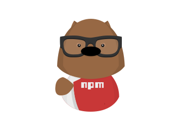

# Node.js

* Node.js nos permite correr ECMAScript en distintos ambientes y con esto realizar distintas tareas
* Dentro de las tareas que podemos realizar se destacan las siguientes:
  * Correr un simple script (como los ejercicios que hicimos al ver el CORE de ECMAScript)
  * Correr el build de nuestro frontend: Gracias a varios módulos que hay disponibles podemos utilizar Node.js como entorno para generar los archivos finales que vamos a deployar en nuestro hosting
  * Correr un servidor web
  * Conectarnos a motores de bases de datos
* En esta parte del curso nos vamos a enfocar en utilizar Node.js para crear un servidor web y poder crear páginas dinámicas en lugar de estáticas como hicimos hasta ahora (con HTML y CSS)
* Al instalar Node.js también se instala otro programa llamado NPM

## NPM
* NPM Significa Node Package Manager
* Utilizando NPM podemos instalar un montón de módulos de Node y utilizarlos en nuestros programas
* NPM es uno de los repositorios más grande que existen
* Para saber más sobre NPM puden ingresar a [su sitio](https://www.npmjs.com)
* Y como si fuera poco tiene la mejor mascota del universo!



### Iniciar un proyecto
* Para iniciar un proyecto en node vamos crear una carpeta con el nombre que quieras y dentro de ella correr el siguiente comando de NPM
* Este comando hace un montón de preguntas pero por ahora podemos ignorarlo y aceptar con enter todos los valores por default

```bash
npm init
```

* Al finalizar este script crea un archivo con el nombre de package.json que no es más que un archivo de configuración en formato JSON

```js
{
  "name": "aprendiend-node",
  "version": "1.0.0",
  "description": "",
  "main": "index.js",
  "scripts": {
    "test": "echo \"Error: no test specified\" && exit 1"
  },
  "author": "",
  "license": "ISC"
}
```

* Como podemos ver utiliza las preguntas anteriores para crear y configurar nuestro proyecto y lo escribe en este archivo
* Es decir que podemos modificar estos valores cuando lo necesitemos

### Configurar scripts de inicio
* Una de las secciones importantes dentro del **package.json** es `scripts` que nos permite crear tareas que podemos correr desde la consola
* Vamos a crear un nuevo script agregando la tarea **start** en la sección `scripts`

```js
"scripts": {
  "test": "echo \"Error: no test specified\" && exit 1"
  "start": "node index.js"
},
```

* Para poder correr esta tarea ejecutamos el siguiente comando desde nuestra consola:

```bash
npm start
```

```bash
Error: Cannot find module 'index.js'
```

* Obtenemos un error similar al ejemplo ya que no existe el archivo **index.js** por lo cual vamos a crearlo
* El archivo index.js tiene que estar al mismo nivel que el archivo package.json para que funcione
* Caso contrario hay que modificar el path del script para que concuerde con la arquitectura de carpetas y archivos que creamos
* Agregamos el siguiente código y volvemos a correr la tarea **start** de NPM

**index.js**
```js
console.log('Bienvenidos a Node.js server side');
```

```bash
npm start
> aprendiend-node@1.0.0 start /ruta
> node index.js

Bienvenidos a Node.js server side
```

* Podemos ver que de esta forma creamos, configuramos y corremos un script desde NPM

### Instalar un módulo
* Utilizando NPM podemos instalar módulos y utilizarlos en nuestros proyectos
* Para lograrlo tenemos que correr desde la consola el comando `install` y el nombre del módulo que queremos instalar
* Por ejemplo vamos a instalar un módulo muy conocido de Node.js que se llama `Express`
* Pueden aprender mucho más sobre `Express` en la [documentaciónd de su sitio](http://expressjs.com)

```bash
npm install express
```

* Al correr la instalación NPM crea una carpeta llamada `node_modules` donde va a guardar todos los módulos que necesitamos instalar para que funcione nuestro proyecto
* La carpeta `node_modules` tiende a crecer mucho y puede ser muy pesada es por eso que vamos a ignorar esta carpeta dentro de la configuración de nuestro repo de GIT
* Esto significa que si alguien más necesita instalar este proyecto tiene que saber la lista de módulos que usa
* Para evitar que esto sea un problema NPM nos permite establecer un parámetro en la instalación de nuestros módulos y guardar una referencia en el archivo package.json
* Borramos la carpeta de `node_modules`
* Volvemos a instalar el módulo de Express pero ahora agregamos el parámetro --save

```bash
npm install express --save
```

**package.json**
```js
"dependencies": {
  "express": "^4.15.4"
}
```

* Podemos ver que en el archivo `package.json` ahora tenemos una sección dependencies donde NPM agrega todas las dependencias que necesita un proyecto
* Volvamos a borrar la carpeta `node_modules` y corramos el siguiente script

```bash
npm install
```

* Al estar configurado `Express` como una dependencia de nuestro proyecto al correr la tarea `npm install` NPM lee las dependencias que tiene en la sección `dependencies` e instala todo por nosotros
* De esta forma otra persona que quiera instalar este proyecto sólo tiene que correr `npm install` para obtener todo funcionando
* Existe otro tipo de dependencia que es sólo para ser utilizando mientras estamos en desarrollo y que no son publicadas
* Para instalar una dependencia como sólo de desarrollo agregamos el parámetro --save-dev en lugar de --save
* Vamos a instalar otro módulo que se llama Morgan sólo como dependencia de desarrollo

```bash
npm install morgan --save-dev
```

**package.json**
```js
"devDependencies": {
  "morgan": "^1.8.2"
}
```

* Luego de correr el instalador obtenemos una nueva sección llamada `devDependencies` donde se configuran todas las dependencias de desarrollo
* Para desinstalar un módulo utilizamos la tarea `npm uninstall` y el nombre del módulo
```bash
npm uninstall morgan
```
* Hasta ahora todos estos módulos fueron instalados de forma local dentro de un proyecto
* NPM también permite instalar módulos de forma global para poder ser utilizados como programas de nuestro sistema en general
* Es decir que al instalar un módulo de manejar global vamos a poder acceder a él y utilizarlo desde cualquier lado
* Cuando instalamos el módulo http-server lo hicimos de manera global
* Utilizamos la tarea npm install y el parámetro -g para instalar un módulo de manera global
* Instalemos el módulo Express Generator de manera global

```bash
npm install express-generator -g
```

* Por las dudas cerramos y volvemos a abrir nuestra consola y corremos el siguiente comando:

```bash
express --help
```

* Si todo funcionó bien vemos el siguiente listado:

```bash
Usage: express [options] [dir]

Options:

  -h, --help           output usage information
      --version        output the version number
  -e, --ejs            add ejs engine support
      --pug            add pug engine support
      --hbs            add handlebars engine support
  -H, --hogan          add hogan.js engine support
  -v, --view <engine>  add view <engine> support (dust|ejs|hbs|hjs|jade|pug|twig|vash) (defaults to jade)
  -c, --css <engine>   add stylesheet <engine> support (less|stylus|compass|sass) (defaults to plain css)
      --git            add .gitignore
  -f, --force          force on non-empty directory
```

* Más entrados en esta sección del curso vamos a utilizar este módulo para crear la arquitectura de nuestro proyecto

## Módulos
* Un módulo es una forma de encapsular código en una sola unidad de código
* Es decir que vamos a agrupar nuestro código por funcionalidad y lo vamos a poner en un archivo que luego podemos utilizar como módulo
* Node.js tiene un sistema de carga de módulos que es muy fácil de utilizar
* Un archivo puede ser utilizado como un módulo dentro del proyecto y se lo trata de forma individual
* La función `require` acepta un string con el nombre del módulo que queremos utilizar
* Node.js al ejecutar `require` busca si existe el nombre del módulo solicitado dentro de la carpeta node_modules

```js
const modulo = require('nombredelmodulo')
```

* Otra forma de cargar un módulo es utilizando rutas relativas
* Por ejemplo si tengo el archivo index.js y el archivo mi-modulo.js puedo cargar mi-modulo desde el index de la siguiente manera

```js
const modulo = require('./mi-modulo')
```

* Algo a destacar es que al utilizar `require` para cargar un módulo no tenemos la necesidad de establecer que la extensión del archivo es **.js**

### Utilizar un módulo desde nuestro script
* Ya que tenemos instalado `Express` en nuestro proyecto vamos a utilizarlo
* Borramos el `console.log()` que escribimos antes en el documento `index.js`
* Agregamos la siguiente línea de código y corremos npm start

```js
const express = require('express')
console.log(express)
```

```bash
npm start
```
* De esta forma le decimos a Node.js que queremos que cargue el módulo Express ya que lo queremos utilizar en este proyecto
* Vemos que express es un objeto de ECMAScript que tiene métodos y propiedades
* Node.js utiliza sus módulos propios y podemos aprender sobre ellos en la [documentación del sitio](https://nodejs.org/api)

### Crear nuestro módulo
* Para entender como funciona un módulo vamos a crear uno primero
* Crear un archivo con el nombre de calcula.js
* Dentro de este archivo vamos a escribir el siguiente código:

**calcular.js**
```js
const ganancia = 50

const calcularPrecio = function(precio) {
  return precio + ganancia
}

module.exports = calcularPrecio
```

**index.js**
```js
const obtenerPrecio = require('./calcular')
const precio = obtenerPrecio(200)
console.log(precio)
```

* En este ejemplo vemos que creamos un módulo que se llama calcular
* Dentro del módulo calcular tenemos una función con el nombre de `calcularPrecio` que nos permite obtener el precio final de un producto con la ganancia que queremos tener
* Utilizando el objeto `module.exports` podemos exportar código desde nuestro módulo para que sea utilizado desde cualquier lado
* En el archivo `index.js` utilizamos `require` para incluir el módulo `calculo` dentro de nuestro proyecto
* Al no ser un módulo que instalamos utilizando npm install podemos acceder a él por medio de la ruta relativa `'./calcular'`
* Creamos el nombre obtenerPrecio y le asignamos lo que esta exportando el módulo, en este caso es tan solo una función pero podría ser un objeto o cualquier otro valor
* Luego en el archivo `index.js` utilizamos la función exportada como hicimos hasta ahora con nuestras funciones
* De esta forma toda la lógica de negocio de como obtener un precio final con la ganancia incluída queda dentro de nuestro módulo `calcula` y nadie puede modificar la ganancia que queremos tener
* Si alguien más necesitara utilizar este módulo podríamos crearlo como un paquete de NPM

### Cómo funcionan los módulos
* Node.js utiliza un patrón llamado módulo para exportar código y utilizarlo desde lo necesitemos
* Al exportar nuestro código Node.js lo mete dentro de una función y de esta forma hace que el scope sea local al módulo y no  a todo el resto del proyecto (las variables son privadas dentro de este módulo y sólo se pueden acceder desde ahí a no ser que nosotros lo exportemos)
* Utilizamos `module.exports` para exportar el código
* Podemos utilizar tan sólo `exports` si queremos de la siguiente manera:

```js
exports = calcularPrecio
```

#### Prácticas
[Ejercicio 1](../ejercicios/consignas/node/ej1.md)
[Ejercicio 2](../ejercicios/consignas/node/ej2.md)
[Ejercicio 3](../ejercicios/consignas/node/ej3.md)
[Ejercicio 4](../ejercicios/consignas/node/ej4.md)
[Ejercicio 5](../ejercicios/consignas/node/ej5.md)

## Arrow Functions
* La documentación actual de Node.js utiliza mucho arrow functions en lugar de la declaración de función que vimos hasta el momento

```js
const miFuncion = function() {
  console.log('mi función');
}

const miFuncionEnES6 = () => {
  console.log('mi función');
}
```

* En este ejemplo vemos como crear una función en ES5 (`miFuncion`) y una `arrow function` en ES6 (`miFuncionEnES6`)
* Las arrow functions son más simples y fácil de escribir
* No utilizamos la palabra function sino utilizamos ()
* Utilizamos => para establecer cual es el valor de retorno que queremos

```js
const miFuncion = function(parametro) {
  console.log('parámetro: ', parametro);
}

const miFuncionEnES6 = (parametro) => {
  console.log('parámetro: ', parametro);
}
```

* Le podemos pasar parámetros a las arrow function de la misma manera que en ES5
* En caso de pasar un solo parámetro podemos obviar los paréntesis de la siguiente manera

```js
const miFuncion = function(parametro) {
  console.log('parámetro: ', parametro);
}

const miFuncionEnES6 = parametro => {
  console.log('parámetro: ', parametro);
}
```

* Para saber más sobre arrow functions pueden leer en el [sitio de MDN](https://developer.mozilla.org/es/docs/Web/JavaScript/Referencia/Funciones/Arrow_functions)

#### Prácticas
[Ejercicio 6](../ejercicios/consignas/node/ej6.md)
[Ejercicio 7](../ejercicios/consignas/node/ej7.md)


## Servidor Web
* Al crear un servidor web con Node.js vamosa a interactuar con los módulos [HTTP/HTTPS](https://nodejs.org/api/http.html)

### Utilizando el módulo HTTP de Node.js podemos crear un servidor web
* Lo primero que necesitamos hacer es requerir el módulo http
* No hace falta correr `npm install` ya que el módulo es propio de Node.js

**Ejemplo Servidor Web con Node.js y el módulo HTTP**
```js
const http = require('http')  
const puerto = 3000
```

* Declaramos una variable `http` para utilizar el módulo con el mismo nombre
* Declaramos una variable con el nombre de `puerto` y le asignamos el número 3000
* Esta variable la vamos a utilizar más adelante para crear nuestro servidor y configurar el puerto


* Para poder crear una instancia de servidor utilizamos el método `createServer`
* Este método acepta como parámetro una función para manejar los pedidos (request) y respuestas(response) al server
* Es decir que le vamos a pasar al método `createServer` un callback que se ejecuta en cada request/response

```js
const requestHandler = (request, response) => {  
  console.log(request.url)
  response.end('Hello Node.js Server!')
}

const server = http.createServer(requestHandler)
```

* Por medio de la función `requestHandler` obtenemos los parámetros `request` para saber datos sobre el pedido y `request` para poder manejar la respuesta
* La función `requestHandler` se va a ejecutar en cada pedido que le hagamos al server
* `response.end` envía la respuesta `'Hello Node.js Server!'` al cliente que realizó el llamado HTTP
* Lo único que nos queda por hacer es decirle al servidor que queremos que `escuche (listen)` en un determinado puerto por si llega algún pedido y que meneje la respuesta

```js
server.listen(port, (err) => {  
  if (err) {
    return console.log('something bad happened', err)
  }

  console.log(`server is listening on ${port}`)
})
```

* El método listen acepta 2 parámetros
* El primero es el puerto a donde tiene que escuchar
* El segundo es un callback que se va a ejecutar al terminar de levantar el servidor
* Este método le pasa al callback un parámetro con la descripción de error en caso de que exista uno (por ejemplo si ya hay algún programa corriendo en el puerto indicado)
* Vamos a ver todo el código junto:

```js
const http = require('http')  
const port = 3000

const requestHandler = (request, response) => {  
  console.log(request.url)
  response.end('Hello Node.js Server!')
}

const server = http.createServer(requestHandler)

server.listen(port, (err) => {  
  if (err) {
    return console.log('something bad happened', err)
  }

  console.log(`server is listening on ${port}`)
})
```

* Copiemos y peguemos este código en un archivo con el nombre de server.js
* Corremos en la consola el siguiente comando

```bash
node server.js
```

* Si todo está bien vemos un mensaje de que el servidor está corriendo en el puerto 3000

```bash
server is listening on 3000
```

* También pdoemos configurar `npm start` para que levante este archivo como hicimos antes con index.js
* Abrimos el browser y navegamos a la siguiente dirección: localhost:3000
* Vemos el mensaje 'Hello Node.js Server!' en pantalla
* Podemos ver que utilizamos localhost ya que el servidor esta corriendo en nuestro ambiente
* Utiliza el puerto 3000 ya que nosotros se lo indicamos
* Si cortamos la ejecución del programa server.js se baja el servidor y ya no vamos a ver la respuesta en localhost:3000
* El módulo HTTP es de muy bajo nivel y por ende es complejo de utilizar para una aplicación real
* Es por esto que existen diferentes módulos que corren sobre HTTP para crear proyectos de manera más fácil
* Los módulos más conocidos son:
  * [Express](http://expressjs.com/)
  * [Hapi](http://hapijs.com/) 
  * [Koa](http://koajs.com/)
  * [Restify](http://restify.com/)
* En esta sección del curso vamos a utilizar Express ya que es el más conocidoy base de todos

#### Prácticas
[Ejercicio 8](../ejercicios/consignas/node/ej8.md)

## Express
* Express es un framework web que nos permite hacer las siguientes tareas:
  * Nos permite manejar cualquier tipo de pedido HTTP (hasta ahora solo usamos GET)
  * Podemos crear rutas específicas
  * Integrar motores de render para crear vistas dinámicas (html creado con datos)
  * Crear `middleware` para procesar los pedidos a nuestro gusto **(feature más importante)**
  * Mucho más
* Express es un framework minimalista por lo cual nos da la base para poder tener un server y vamos a utilizar otros módulos para casos específicos como manejar una session, cookies y hasta manejar los datos que nos lleguen por POST
* Algunos [módulos son mantenidos por el equipo de Express](http://expressjs.com/en/resources/middleware.html)
* Express nos da la oportunidad de configurar todo a nuestro modo y eso nos da mucha flexibilidad a la hora de crear un proyecto
* Si bien esto es un beneficio también tenemos que aprender que módulos queremos usar y cómo vamos a crear la arquitectura del servidor
* No existe una receta única para resolver un problema con Express

### Crear un servidor
* En general un servidor web es una aplicación que escucha en un puerto por pedidos HTTP
* Al recibir un pedido tiene configurado que tiene que hacer para generar una respuesta
* Estos request pueden tener datos como pueden ser el id de un producto, un criterio de busqueda o el username y password de un usuario
* Con estos datos el servidor puede interactuar con una base de datos o no según el caso
* Si el servidor tiene que mandar un response con un documento HTML lo puede hacer de manera estática (como venimos haciendo hasta ahora)
* También puede leer datos de una base de datos, crear un documento HTML de forma dinámica (utilizando los datos) y mandar ese documento como respuesta al cliente 
* Para crear los documentos HTML dinámico se pueden utilizar motores de template
* Express nos permite manejar las rutas para cada request y configurar como tiene que ser la respuesta
  * Configurar donde estan los archivos
  * Qué template se tiene que usar en cada oportunidad
  * Qué motor de template vamos a utilizar
  * Dónde van a estar guardados los archivos estáticos que queremos utilizar
* Para el resto de las tareas vamos a agregar módulos específicos

**Ejemplo:**
```js
const express = require('express');
const app = express();

app.get('/', function(request, response) {
  response.send('Hello World!');
});

app.listen(3000, function() {
  console.log('Example app listening on port 3000!');
});
```

* En este ejemplo vemos como crear un server con Express
* Requerimos el módulo Express que nos exporta una función y la asignamos a una variable
* Por medio de la función express() creamos una nueva instancia de nuestro servidor
* Con el método `get` configuramos una ruta en la raíz de nuestro sitio `/`
* Utilizamos el método listen para configurar el puerto donde queremos levantar el server y un callback que se ejecuta al terminar de levantar el servidro
* Al correr este script podemos ver nuestro sitio en `localhost:3000`

#### Prácticas
[Ejercicio 9](../ejercicios/consignas/node/ej9.md)

### Crear rutas - GET
* Con Express podemos crear rutas de forma muy fácil
* Utilizamos el método `get` para obtener requests por `GET`
* Este método recibe un string como primer parámetro especificando la ruta que queremos manejar (Ejemplo la raíz de nuestro sitio '/')
* Como segundo parámetro le pasamos un callback con la función que tiene que ejecutar cuando se llame a la ruta configurada
* Este callback recibe los objetos `request` y `response` como parámetro
* El objeto `response` tiene un método `send` para enviar una respuesta

**Ejemplo:**
```js
app.get('/', function(req, res) {
  res.send('Hello World!');
});
```

* El objeto de Express tiene múltiples métodos para manejar `requests` para todos los verbos de HTTP

**Ejemplo:**
```js
app.post('/', function(req, res) {
  res.send('Utilizamos el método post para manejar un request por POST');
});

app.put('/', function(req, res) {
  res.send('Utilizamos el método put para manejar un request por PUT');
});

app.delete('/', function(req, res) {
  res.send('Utilizamos el método delete para manejar un request por DELETE');
});
```

* También nos provee un método `all` para manejar todos los verbos juntos
* Este método es muy útil para configurar `middleware` para todos los tipos de requests

**Ejemplo:**
```js
app.all('/', function(req, res) {
  res.send('Utilizamos el método all para manejar todos los tipos de requests');
});
```

* De esta forma podemos crear las rutas que necesitamos para nuestro proyecto

**Ejemplo:**
```js
app.get('/productos', function(req, res) {
  res.send('Mostramos una lista de productos');
});

app.post('/productos', function(req, res) {
  res.send('Creamos un Producto');
});

app.put('/productos', function(req, res) {
  res.send('Actualizamos un Producto');
});

app.delete('/productos', function(req, res) {
  res.send('Borramos un Producto');
});
```

* Utilizando el browser sólo podemos hace llamados por GET 
* Existe una herramienta llamada [Postman](https://www.getpostman.com/) que nos permite hacer cualquier tipo de llamado y ver la respuesta
* Configuramos la url que queremos utilizar
* Usamos el botón de send para hacer un `request`
* Vemos la respuesta en la parte inferior


* Postman también nos da información sobre el status de nuestro `request` (ejemplo: 200)
* Podemos ver los encabezados enviados y recibidos
* También podemos realizar distintos tipos de llamados como pueden ser POST, PUT, DELETE, etc


#### Prácticas
[Ejercicio 10](../ejercicios/consignas/node/ej10.md)

### Manejar la respuesta
* Por medio del objeto `response` podemos acceder a distintos métodos para enviar una respuesta al cliente
* Podemos configurar desde retornar un JSON para un llamado de API hasta enviar un documento HTML estático o dinámico
* En el [sitio de Express](https://expressjs.com/en/guide/routing.html#response-methods) podemos ver todos los tipos de respuesta que podemos utilizar

**JSON**
* El método `json` nos permite enviar una respuesta del tipo JSON
* Acepta un objeto y lo transforma a formato JSON
* También envía todos los `headers` correctos para decirle al cliente que la respuesta está en formato JSON

**Ejemplo:**
```js
app.get('/', function(req, res) {
  res.json({ nombre: 'Marta', edad: '40'});
});
```

**sendFile**
* Podemos retornar cualquier tipo de archivo utilizando el método `sendFile`
* Este método nos permite retornar por ejemplo un archivo HTML específico

**Ejemplo:**
```js
const express = require('express')
const app = express()
const path = require('path')

app.get('/', function(request, response) {
  response.sendFile(path.join(__dirname, 'index.html'));
});

app.listen(3000, function() {
  console.log('Example app listening on port 3000!');
});
```

* Para poder enviar un archivo tenemos que especificar la ruta absoluta del documento
* Usamos el módulo `path` de node para crear la ruta
* Existe una variable especial `__dirname` que nos permite obtener la ruta absoluta al directorio donde se esta ejecutando un script
* Por medio del método `join` podemos concatener la ruta del directorio (`__dirname`) y el nombre de nuestro archivo HTML

#### Prácticas
[Ejercicio 11](../ejercicios/consignas/node/ej11.md)
[Ejercicio 12](../ejercicios/consignas/node/ej12.md)

### Router
* Por medio del concepto de `router` podemos configurar nuestras rutas de mejor forma
* Si nuestro sitio crece mucho puede ser complejo leer y mantener las rutas de todo el sitio

**Router de nuestra Home**
```js
// archivo home.js
var express = require('express');
var router = express.Router();

router.get('/', function(req, res) {
  res.send('Usamos el método POST');
});

router.post('/', function(req, res) {
  res.send('Usamos el método POST');
});

module.exports = router;
```

**Montamos el router**
```js
const express = require('express')
const app = express()
var wiki = require('./home.js');

app.use('/', wiki);
```

* En este ejemplo vemos que podemos utilizar el concepto de `Router` para crear nuevas rutas de nuestro sitio
* En un módulo creado por nosotros podemos agrupar todas las rutas que queremos según nuestro criterio
* Luego importamos los distintos módulos de ruta que armamos y los montamos en la dirección que queremos

#### Prácticas
[Ejercicio 13](../ejercicios/consignas/node/ej13.md)

### Manejo de status y errores
* El objeto response tiene el método status que nos permite establecer el código de HTTP que queremos mandar como respuesta
* Si no establecemos ninguno por default es 200
* Acepta un number como parámetro
* Podemos encadenar otros llamados

**Ejemplo:**
```js
app.get('/', function(request, response) {
  res.status(200).json({ nombre: 'Pepe', apellido: 'Martin'});
});

app.get('/error', function(request, response) {
  res.status(500).send('Server error');
});
```

* En este ejemplo vemos que podemos establecer el código de HTTP para el status de la respuesta
* Para manejar el status 404 podemos crear el siguiente manejador de rutas

**Ejemplo:**
```js
app.use(function (req, res, next) {
  res.status(404).send("Sorry can't find that!")
})
```

* De esta forma establecemos que Express intente manejar las rutas y en caso de no encontrar el documento significa que no existe
* Por eso podemos establecer el código de status en 404 y mandar la respuesta que necesitemos con el mensaje de error
* Por otro lado Express tiene una manera de manejar los errores
* Para esto tenemos que agregar la siguiente configuración:

**Ejemplo:**
```js
app.use(function (err, req, res, next) {
  console.error(err.stack)
  res.status(500).send('Something broke!')
})
```

* Podemos ver que es bastante similar pero le agrega un par de parámetros más
  * El primer parámetro es el error, de esta forma podemos saber que pasóß
  * El segundo parámetro es el objeto `request` que es el mismo que vamos a utilizar dentro de las rutas
  * El tercer parámetro es el objeto `response` que también es el mismo que vamos a utilizar dentro de las rutas
  * Finalmente obtenemos un callback llamado next que nos permite seguir el flujo de filtros que aplica express
* Con esta configuración si hay algún error lo vamos a poder atrapar y responderle al usuario correctamente
* Es una buena práctica agregar estas dos configuración (404 y 500) a nuestro servidor de Express
* Ambos callbacks que le pasamos al método `use` se llaman `middleware` y nos dan muchas opciones a la hora de configurar nuestro servidor

### Middleware
* El concepto de middleware en Express no es más que un callback que se puede configurar para que se ejecute en algún momento
* Estos middlaware nos dejan modificar el objeto `request` y `response`
* Gracias a esta arquitectura podemos agregarle funcionalidad a nuestro servidor de express ya sea creando nuestros propios middlawares o usando algunos ya existentes
* Express tiene una gran cantidad de middlawares que se pueden configurar
* Para entender mejor este concepto vamos a ver un ejemplo

**Ejemplo:**
```js
const express = require('express');
const app = express();

const miMiddleware = function(req, res, next) {
  console.log('paso por un middlaware')
  next()
}

app.use(miMiddleware);

app.use('/someroute', miMiddleware);

app.get('/', miMiddleware);

app.listen(3000);
```

* En este ejemplo creamos una nueva función que acepta 3 parámetros y la asignamos a la variable miMiddleware
* En la firma de esta función encontramos los siguientes parámetros:
  * req: es el objeto `request`
  * res: es el objeto `response`
  * next: es un callback que nos permite llamar al próximo middleware
* Dentro de la función `miMiddleware` vemos que mostramos un mensaje en consola y luego llamamos a `next()`
* De esta forma podemos crear como una cadena de filtros de middlewares que se llaman los unos a los otros en el orden que nosotros los fuimos configurando
* Por medio del método `use` podemos configurar un middleware
* Podemos establecer que se use para todos los llamados como en el ejemplo de `app.use(miMiddleware)`
* También lo podemos configurar para que se aplique tan solo en una ruta como vemos en el ejemplo `app.get('/', miMiddleware)`
* Y hasta lo podemos configurar para usarlo tan solo en una ruta y en un sólo verbo de HTTP como es el caso de `app.get('/', miMiddleware)`
* También podemos configurar y utilizar un middleware desde un módulo de la siguiente forma

**Ejemplo:**
```js
const express = require('express');
const logger = require('morgan');
const app = express();

app.use(logger('dev'));
```

* En este ejemplo estamos configurando un módulo llamado [morgan](https://github.com/expressjs/morgan) como middleware de nuestro servidor
* Este middleware logea los llamados que le hacen a nuestro servidor
* Podemos ver en el sitio del módulo que es muy fácil de configurar y usar
* De esta forma podemos buscar otros módulos que le agreguen funcionalidad a nuestro servidor
* Para saber más sobre middleware pueden ingresar al [sitio de Express](https://expressjs.com/es/guide/writing-middleware.html)

### Contenido estático
* Express permite configurar carpetas para servir contenido estático sin tener que pasar por un controlador de ruta
* Es decir que si entramos a una ruta que express no maneja se va a fijar si existe como contenido estático
* Esta funcionalidad nos viene super bien para poder agregar archivos js para el cliente, css, imágenes o archivos html estáticos
* Una buena forma de ir armando la arquitectura de nuestro servidor es servir todos los archivos desde una misma carpeta
* Dado que es contenido estático y público podemos crear la carpeta `public` para este propósito

* En cuanto tenemos la carpeta creada podemos configurar Express usando el método `static`

**Ejemplo:**
```js
const express = require('express')
const app = express()
app.use(express.static('public'));
```

* En este ejemplo configuramos la carpeta public como contenedor de nuestros assets estáticos
* Es decir que podemos llamar al server de la siguiente forma y obtener una respuesta automática manejada por Express
* No tenemos que definir rutas específicas (get, post, etc) para el contenido estático ya que siempre es por get
* Si dentro de la carpeta public tenemos carpetas, img, css, js para nuestros archivos podemos llamar al server de la siguiente manera:
  * http://localhost:3000/img/logo.png
  * http://localhost:3000/js/script.js
  * http://localhost:3000/css/style.css
  * http://localhost:3000/productos.html
* Como podemos ver en los ejemplos nos crea por default un acceso al raiz del sitio
* Podemos configurar cómo se acceden a los assets de la siguiente manera:

**Ejemplo:**
```js
const express = require('express')
const app = express()
app.use('/assets', express.static('public'));
```
* En este ejemplo le decimos a express que utilice la url `/assets` para los archivos que estan dentro de la carpeta `public`
* Dada la nueva configuración accedemos a los assets de la siguiente manera:
  * http://localhost:3000/assets/img/logo.png
  * http://localhost:3000/assets/js/script.js
  * http://localhost:3000/assets/css/style.css
  * http://localhost:3000/assets/productos.html
* Como beneficio podemos utilizar cualquier carpeta para nuestro contenido estático
* No le estamos dando información al usuario sobre nuestra arquitectura
* Podemos cambiar la carpeta en cualquier momento con tan solo mantener la ruta donde montamos el contenido
* También podemos configurar más de una carpeta
* En caso de que Express no encuentre el asset requerido va a seguir buscando en las otras carpetas

**Ejemplo:**
```js
app.use(express.static('public'));
app.use(express.static('otracarpeta'));
```

* En este caso Express intenta primero buscar en la carpeta `public` y luego en la `otracarpeta`

### Usar templates
* Otro de los beneficios que tiene utilizar Express es que nos permite configurar un engine de template para crear nuestros documentos estáticos
* Existen diferentes motores de template que podemos configurar
* Vamos a utilizar y configurar [Handlebars](http://handlebarsjs.com/) como motor de template
* Para saber más sobre este template engine pueden ingresar a su sitio
* Dado qeu Handlebars es un poco complicado para configurar vamos a utilizar un módulo que nos facilita su uso
* Instalamos [express-handlebars]()

```bash
npm install express-handlebars --save
```

* Luego de instalar el módulo de `express-handlebars` tenemos que crear la siguiente arquitectura de carpetas

**Estructura de directorios:**
```
.
├── index.js
└── views
    ├── home.handlebars
    └── layouts
        └── main.handlebars
```

* En la carpeta views vamos a poner todos nuestros templates
* La carpeta layouts guarda los archivos que van a funcionar como marco general de nuestros templates

**main.handlebars**
```html
<!DOCTYPE html>
<html>
<head>
    <meta charset="utf-8">
    <title>Example App</title>
</head>
<body>
    {{{body}}}
</body>
</html>
```

**home.handlebars**
```html
<h1>Home</h1>
<p>Sitio generado utilizando templates de <a href="http://handlebarsjs.com/">Handlebars</a></p>
```

**index.js**
```js
const express = require('express')
const exphbs  = require('express-handlebars')
const app = express()

app.engine('handlebars', exphbs({defaultLayout: 'main'}))
app.set('view engine', 'handlebars')

app.get('/', function (req, res) {
    res.render('home')
})

app.listen(3000)
```

* En este ejemplo creamos 2 partes del template:
  * main.handlebars: es el layout general de nuestro sitio. En este documento podemos poner todo lo que queremos que tengan en común todos los documentos. Es como el marco de nuestro sitio. Evita que tengamos que repetir toda la estructura en cada archivo
  * home.handlebars: En este documento ponemos el contenido específico para una sección, en este ejemplo es el Home de nuestro sitio
* Por otro lado tenemos una archivo **index.js** que contiene nuestro servidor Express
* `app.engine('handlebars', exphbs({defaultLayout: 'main'}))` configura que usamos un layout con handlebars
* `app.set('view engine', 'handlebars')` establece que queremos usar handlebars como motor de nuestros templates
* Finalmente tenemos un manejador de ruta para la home de nuestro sitio `/` y utilizamos el método `render` de Express para renderizar el template
* Es en este momento donde se compila el layout y el contenido del sitio para crear un archivo HTML que estamos mandando como respuesta en el método `render`
* Podes leer más sobre el método [render en el sitio de Express](http://expressjs.com/es/api.html#app.render)

### Armar un sitio 
* Si hacemos todos los pasos hasta acá podemos tener configurado un sitio inicial
* Vamos a crear algunas secciones para armar un sitio usando templates
* Agregamos los nuevos archivos que vamos a necesitar

```
.
├── index.js
└── views
    ├── home.handlebars
    ├── contact.handlebars
    ├── products.handlebars
    └── layouts
        └── main.handlebars
```

* Agregamos el contenido a cada archivo:

**main.handlebars**
```html
<!DOCTYPE html>
<html>
<head>
  <meta charset="utf-8">
  <title>Mi primer app con templates</title>
  <link rel="stylesheet" href="css/styles.css">
  <script src="js/script.js"></script>
</head>
<body>
    <nav>
      <ul>
        <li>
          <a href="/">
            
          </a>
        </li>
        <li>
          <a href="/products">Products</a>
        </li>
        <li>
          <a href="/contact">Contact</a>
        </li>
      </ul>
    </nav>
    <section>
      {{{body}}}
    </section>
    <footer>
      <div>Copyright © 2017 Apple Inc. All rights reserved.</div>
    </footer>
</body>
</html>
```

**home.handlebars**
```html
<h1>Apple</h1>
<p>Bienvenido al sitio de apple.com!!</p>
```

**products.handlebars**
```html
<h1>Apple - Products</h1>
<p>Listado de productos</p>

<h2>MacBook</h2>
<ul>
  <li>MacBook</li>
  <li>MacBook Air</li>
  <li>MacBook Pro</li>
  <li>iMac</li>
  <li>iMac Pro</li>
  <li>Mac Pro</li>
  <li>Mac mini</li>
  <li>Accessories</li>
  <li>High Sierra</li>
</ul>

<h2>iPad</h2>
<ul>
  <li>iPad Pro</li>
  <li>iPad</li>
  <li>iPad mini 4</li>
  <li>iOS 11</li>
  <li>Accessories</li>
</ul>

<h2>Iphone</h2>
<ul>
  <li>iPhone X</li>
  <li>iPhone 8</li>
  <li>iPhone 7</li>
  <li>iPhone 6s</li>
  <li>iPhone SE</li>
  <li>iOS 11</li>
  <li>Accessories</li>
</ul>
```

**contact.handlebars**
```html
<h1>Apple - Contact</h1>
<form action="#">
  <div>
    <label for="fname">First Name</label>
    <input type="text" id="fname" name="firstname" placeholder="Your name..">
  </div>
  <div>
    <label for="lname">Last Name</label>
    <input type="text" id="lname" name="lastname" placeholder="Your last name..">
  </div>
  <div>
    <label for="country">Country</label>
    <select id="country" name="country">
      <option value="argentina">Argentina</option>
      <option value="australia">Australia</option>
      <option value="canada">Canada</option>
      <option value="usa">USA</option>
    </select>
  </div>
  <div>
    <label for="subject">Subject</label>
    <textarea id="subject" name="subject" placeholder=""></textarea>
  </div>
  <input type="submit" value="Submit">
</form>
```

* En nuestro archivo index.js agregamos soporte para archivos estáticos
* De esta forma podemos crear la carpeta public y agregar las carpetas img, css y js
* También agregamos los manejadores de urls para `'/products'` y `'/contact'`
* Cada vista renderiza su propio template
* En todos los caso utilizamos el layout general

**index.js**
```js
app.use(express.static('public'))

app.get('/products', function (req, res) {
  res.render('products')
})

app.get('/contact', function (req, res) {
  res.render('contact')
})
```

**public/js/script.js**
```js
window.onload=function() {
  console.log('Cargamos el sitio usando templates!!!')
}
```

* Finalmente agregamos el css

**public/css/styles.css**
```css
body {
  background: white;
  font-family: Arial, Helvetica, sans-serif;
  margin: 0;
  padding: 0;
}

nav {
  border-bottom: 1px solid black;
  padding-left: 20px;
  background: rgba(0,0,0,0.8);
}

nav ul {
  list-style-type: none;
  margin: 0;
  padding: 0;
}
nav ul li {
  display: inline-block;
}

nav ul li:first-child {
  margin-right: 10px;
}

nav ul li img {
  vertical-align: middle;
}

nav ul li a {
  text-decoration: none;
  color: white;
  display: block;
}
nav ul li a:hover{
  text-decoration: underline;
}

section {
  padding-left: 20px;
}

footer {
  padding-left: 20px;
  margin-top: 100px;
  font-size: 12px;
}

form div {
  margin-bottom: 10px;

}

form div label {
  display: inline-block;
  width: 100px;
}

form input {
  width: 200px;
  padding: 5px;
}

form select {
  width: 215px;
  height: 20px;
}

form textarea {
  width: 200px;
  padding: 5px;
}

form input[type=submit] {
  width: 100px;
  font-size: 12px;
  line-height: 1.5;
  font-weight: 400;
  letter-spacing: 0em;
  font-family: "SF Pro Text","SF Pro Icons","Helvetica Neue","Helvetica","Arial",sans-serif;
  min-width: 20px;
  padding-left: 10px;
  padding-right: 10px;
  padding-top: 1px;
  padding-bottom: 1px;
  background: linear-gradient(#42a1ec, #0070c9);
  border-color: #07c;
  border-width: 1px;
  border-style: solid;
  border-radius: 4px;
  color: #fff;
  cursor: pointer;
  display: inline-block;
  text-align: center;
  white-space: nowrap;
}
```

* Al unir todos estos templates, carpetas y archivos tenemos nuestro servidor listo
* Usando layouts y templates es más fácil crear y mantener sitios

[Ejercicio 14](../ejercicios/consignas/node/ej14.md)
[Ejercicio 15](../ejercicios/consignas/node/ej15.md)
[Ejercicio 16](../ejercicios/consignas/node/ej16.md)
[Ejercicio 17](../ejercicios/consignas/node/ej17.md)

### Renderizar valores
* Si bien tener layouts y secciones de html está bueno todavía no lo hace dinámico
* Podemos utilizar las expresiones de Handlebars para introducir contenido dentro de los templates
* Para renderizar un valor desde ECMAScript dentro del template de handlebars usamos `{{valor}}`

**pr
oducts.handlebars**
```html
<div>{{nombre}}</div>
```
```js
  res.render('products', { nombre: 'Mi Producto'})
```

* En este ejemplo vemos que utilizamos `{{nombredevariable}}` para imprimir un valor dentro del template
* Desde Express podemos utilizar el método render para configuar el contenido y los valores
* Como segundo parámetro render acepta un objeto donde las propiedades van a ser los nombres de variables que vamos a utilizar en el template
* En este ejemplo el template renderiza el texto **Mi Producto** ya que le pedimos que remplace la variable `nombre` por el contenido de la propiedad `nombre` que le pasamos como segundo parámetro a `render`
* En handlebars tenemos helpers que podemos utilizar dentro de nuestros templates:
* Por ejemplo podemos utilizar `if` de la siguiente forma:

```html
<div>
  {{#if user}}
    <p>{{firstName}} {{lastName}}</p>
  {{/if}}
</div>
```

* También podemos iterar sobre colecciones de la siguiente manera:

```html
<ul>
{{#each products}}
  <li>{{this}}</li>
{{/each}}
</ul>
```
```js
  res.render('products', { nombre: 'Mi Producto', products: ['tv', 'printer', 'ps4']})
```

* En este ejemplo iteramos la colección de productos y creamos una lista de forma dinámica
* Existen varios helpers más y también podemos crear los nuestros si lo necesitamos
* Este es un gran momento para ver la [documentación de Handlebars](http://handlebarsjs.com) para aprender más sobre este template engine

### Crear un form

### Crear rutas - POST

### Obtener datos desde un form

## Crear una API rest
